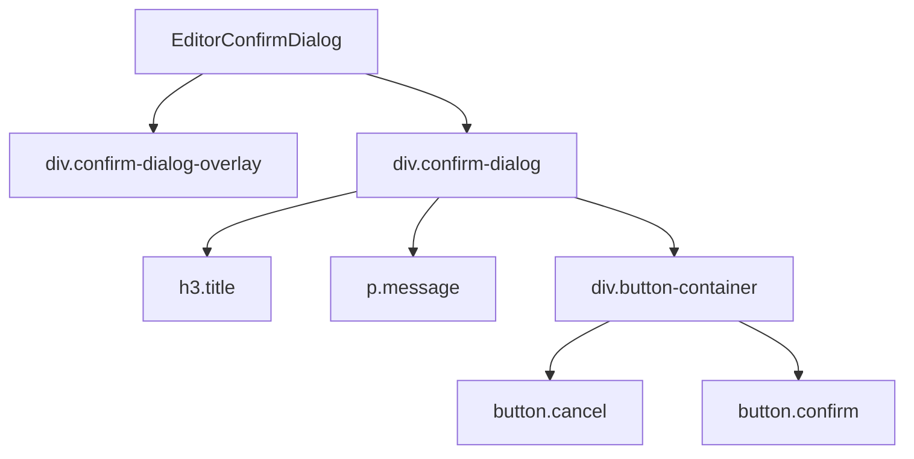

# Документация для src/components/editor/ui/EditorConfirmDialog.js

## 1. Назначение файла

Файл `src/components/editor/ui/EditorConfirmDialog.js` определяет компонент диалога подтверждения. Он заменяет стандартный `window.confirm()` для корректной работы в Electron приложении.

## 2. Экспортируемые компоненты и классы

### EditorConfirmDialog
Компонент диалога подтверждения:
- **Тип**: React компонент
- **Назначение**: Отображает модальное окно подтверждения действий
- **Пропсы**:
  - `isOpen` (boolean) - состояние открытия диалога
  - `title` (string) - заголовок диалога (по умолчанию 'Подтверждение')
  - `message` (string) - сообщение диалога
  - `onConfirm` (function) - обработчик подтверждения
  - `onCancel` (function) - обработчик отмены
  - `confirmText` (string) - текст кнопки подтверждения (по умолчанию 'Да')
  - `cancelText` (string) - текст кнопки отмены (по умолчанию 'Отмена')
  - `darkMode` (boolean) - режим темной темы (по умолчанию false)

## 3. Структуру экспорта

```javascript
// Экспорт компонента EditorConfirmDialog
export const EditorConfirmDialog = ({ isOpen, title = 'Подтверждение', message, onConfirm, onCancel, confirmText = 'Да', cancelText = 'Отмена', darkMode = false }) => {...};

// Экспорт по умолчанию
export default EditorConfirmDialog;
```

## 4. Взаимодействие с другими компонентами

### Внутренние зависимости
- `React` - основной фреймворк для построения интерфейса

### Используемые компоненты внутри EditorConfirmDialog
1. `div` - HTML элементы для создания структуры диалога
2. `h3` - HTML элемент для заголовка
3. `p` - HTML элемент для сообщения
4. `button` - HTML элементы для кнопок действий

### Вспомогательные функции
- `handleConfirm` - обработчик подтверждения
- `handleCancel` - обработчик отмены
- `handleKeyDown` - обработчик нажатий клавиш (Escape, Enter)

## 5. Используемые зависимости

### Внешние зависимости
- `React` - основной фреймворк для построения интерфейса

## 6. Архитектура компонента

Компонент `EditorConfirmDialog` представляет собой простой UI компонент для отображения диалогов подтверждения. Он использует CSS-in-JS для стилизации и адаптирует внешний вид под темную или светлую тему.



Компонент реализует следующую функциональность:
1. Отображение модального окна поверх основного интерфейса
2. Обработка кликов вне области диалога как отмену
3. Обработка нажатий клавиш Escape (отмена) и Enter (подтверждение)
4. Адаптация стилей под темную/светлую тему
5. Настройка текстов кнопок и заголовка