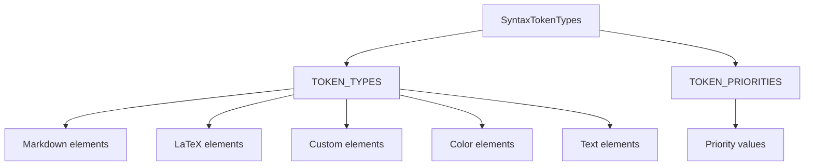

# Документация для src/components/editor/ui/syntax/SyntaxTokenTypes.js

## 1. Назначение файла

Файл `src/components/editor/ui/syntax/SyntaxTokenTypes.js` определяет типы токенов для подсветки синтаксиса. Он содержит все типы элементов, которые могут быть подсвечены, а также приоритеты токенов для правильной обработки пересекающихся элементов.

## 2. Экспортируемые компоненты и классы

### TOKEN_TYPES
Объект с типами токенов:
- **Тип**: Объект
- **Назначение**: Определяет все типы элементов, которые могут быть подсвечены

#### Свойства TOKEN_TYPES:
- `HEADER_1` - заголовок 1 уровня
- `HEADER_2` - заголовок 2 уровня
- `HEADER_3` - заголовок 3 уровня
- `BOLD` - жирный текст
- `ITALIC` - курсивный текст
- `CODE` - код
- `LINK` - ссылка
- `LIST_ITEM` - элемент списка
- `HR` - горизонтальная линия
- `LATEX` - LaTeX формула
- `BOX_LATEX` - блочная LaTeX формула
- `TAG` - тег
- `SYMBOL` - символ
- `HANDLE` - хендл
- `IMAGE` - изображение
- `ELEMENT` - элемент
- `LINK_ELEMENT` - ссылка-элемент
- `NAME` - имя
- `COLOR` - цвет текста
- `BG_COLOR` - цвет фона
- `TEXT` - обычный текст

### TOKEN_PRIORITIES
Объект с приоритетами токенов:
- **Тип**: Объект
- **Назначение**: Определяет приоритеты токенов для обработки пересекающихся элементов

#### Свойства TOKEN_PRIORITIES:
- Числовые значения приоритетов для каждого типа токена (чем выше число, тем выше приоритет)

## 3. Структуру экспорта

```javascript
// Экспорт объекта TOKEN_TYPES
export const TOKEN_TYPES = {...};

// Экспорт объекта TOKEN_PRIORITIES
export const TOKEN_PRIORITIES = {...};
```

## 4. Взаимодействие с другими компонентами

### Внутренние зависимости
- Нет внутренних зависимостей

### Используемые компоненты
1. `TOKEN_TYPES` - объект с типами токенов
2. `TOKEN_PRIORITIES` - объект с приоритетами токенов

## 5. Используемые зависимости

### Внешние зависимости
- Нет внешних зависимостей

### Внутренние зависимости
- Нет внутренних зависимостей

## 6. Архитектура компонента

Файл `SyntaxTokenTypes.js` представляет собой конфигурационный файл, определяющий типы токенов и их приоритеты для системы подсветки синтаксиса.



Файл реализует следующую функциональность:
1. Определение типов токенов для всех поддерживаемых элементов
2. Установка приоритетов для правильной обработки пересекающихся элементов
3. Группировка элементов по категориям (Markdown, LaTeX, кастомные, цветовые)
4. Предоставление констант для использования в других компонентах системы подсветки