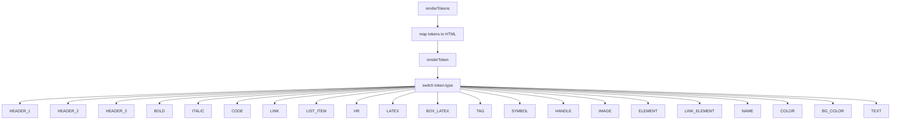

# Документация для src/components/editor/ui/syntax/TokenRenderer.js

## 1. Назначение файла

Файл `src/components/editor/ui/syntax/TokenRenderer.js` определяет функции для рендеринга токенов в HTML. Он преобразует токены, созданные системой токенизации, в HTML разметку с соответствующими CSS классами для подсветки синтаксиса.

## 2. Экспортируемые компоненты и классы

### renderTokens
Функция рендеринга массива токенов:
- **Тип**: Функция
- **Назначение**: Преобразует массив токенов в HTML строку
- **Параметры**:
  - `tokens` (Array) - массив токенов для рендеринга
  - `darkMode` (boolean) - режим темной темы
- **Возвращает**: HTML строка

### renderToken
Функция рендеринга отдельного токена:
- **Тип**: Функция
- **Назначение**: Преобразует отдельный токен в HTML строку
- **Параметры**:
  - `token` (Token) - токен для рендеринга
  - `darkMode` (boolean) - режим темной темы
- **Возвращает**: HTML строка

## 3. Структуру экспорта

```javascript
// Экспорт функции renderTokens
export function renderTokens(tokens, darkMode) {...}

// Экспорт функции renderToken
export function renderToken(token, darkMode) {...}
```

## 4. Взаимодействие с другими компонентами

### Внутренние зависимости
- `./SyntaxHighlighterUtils` - утилиты для подсветки синтаксиса
- `./SyntaxTokenTypes` - типы токенов

### Используемые компоненты внутри функций рендеринга
1. `escapeHtml` - функция экранирования HTML
2. `getTokenColor` - функция получения цвета для токена
3. `TOKEN_TYPES` - типы токенов

### Вспомогательные функции
- Нет вспомогательных функций

## 5. Используемые зависимости

### Внешние зависимости
- Нет внешних зависимостей

### Внутренние зависимости
- `./SyntaxHighlighterUtils` - утилиты для подсветки синтаксиса
- `./SyntaxTokenTypes` - типы токенов

## 6. Архитектура компонента

Файл `TokenRenderer.js` представляет собой набор функций для преобразования токенов в HTML разметку. Он использует switch-case для определения типа токена и применения соответствующей разметки.



Файл реализует следующую функциональность:
1. Рендеринг массива токенов в HTML строку
2. Рендеринг отдельных токенов в HTML разметку
3. Применение CSS классов для каждого типа токена
4. Экранирование HTML содержимого токенов
5. Обработка цветовых токенов с применением inline стилей
6. Обработка блочных элементов с дополнительными стилями
7. Возврат обычного текста для текстовых токенов