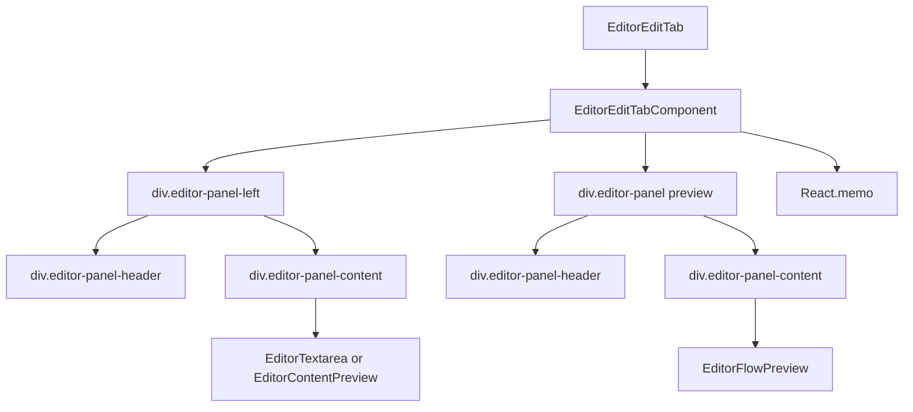

# Документация для src/components/editor/ui/tabs/EditorEditTab.js

## 1. Назначение файла

Файл `src/components/editor/ui/tabs/EditorEditTab.js` определяет вкладку редактирования с предварительным просмотром в редакторе. Она содержит панель редактирования и панель предварительного просмотра, которые могут отображаться одновременно.

## 2. Экспортируемые компоненты и классы

### EditorEditTab
Компонент вкладки редактирования:
- **Тип**: React компонент (memo)
- **Назначение**: Отображает вкладку редактирования с возможностью предварительного просмотра
- **Пропсы**:
  - `content` (string) - содержимое редактора
  - `onChange` (function) - обработчик изменения содержимого
  - `onImageUpload` (function) - обработчик загрузки изображений
  - `darkMode` (boolean) - режим темной темы
  - `showPreview` (boolean) - отображение панели предварительного просмотра
  - `onTogglePreview` (function) - обработчик переключения предварительного просмотра
  - `nodeWidth` (number) - ширина узла
  - `textareaRef` (React.RefObject) - ссылка на textarea
  - `onInsertElement` (function) - обработчик вставки элементов
  - `onInsertMarkdown` (function) - обработчик вставки markdown
  - `showTextarea` (boolean) - отображение текстового поля
  - `onToggleTextarea` (function) - обработчик переключения текстового поля

## 3. Структуру экспорта

```javascript
// Экспорт компонента EditorEditTab
export const EditorEditTab = React.memo(EditorEditTabComponent, (prevProps, nextProps) => {...});
```

## 4. Взаимодействие с другими компонентами

### Внутренние зависимости
- `React` - основной фреймворк для построения интерфейса
- `../EditorIcons` - иконки редактора
- `../EditorTextarea` - текстовое поле редактора
- `../preview` - компоненты предварительного просмотра
- `../wysiwyg` - компоненты WYSIWYG редактора
- `../../constants` - константы редактора

### Используемые компоненты внутри EditorEditTab
1. `div` - HTML элементы для создания структуры вкладки
2. `button` - HTML элементы для кнопок переключения
3. `EditorTextarea` - текстовое поле редактора
4. `EditorFlowPreview` - компонент предварительного просмотра Flow
5. `EditorContentPreview` - компонент предварительного просмотра контента
6. `EditorIcons` - иконки редактора

### Вспомогательные функции
- `EditorEditTabComponent` - основной компонент вкладки редактирования

## 5. Используемые зависимости

### Внешние зависимости
- `React` - основной фреймворк для построения интерфейса

### Внутренние зависимости
- `../EditorIcons` - иконки редактора
- `../EditorTextarea` - текстовое поле редактора
- `../preview` - компоненты предварительного просмотра
- `../wysiwyg` - компоненты WYSIWYG редактора
- `../../constants` - константы редактора

## 6. Архитектура компонента

Компонент `EditorEditTab` представляет собой сложный UI компонент, объединяющий панель редактирования и панель предварительного просмотра. Он использует мемоизацию для оптимизации производительности.



Компонент реализует следующую функциональность:
1. Отображение панели редактирования с текстовым полем или WYSIWYG редактором
2. Отображение панели предварительного просмотра Flow
3. Переключение между текстовым полем и WYSIWYG редактором
4. Переключение отображения панели предварительного просмотра
5. Адаптация под темную/светлую тему
6. Оптимизация производительности через мемоизацию
7. Использование CSS-in-JS для стилизации