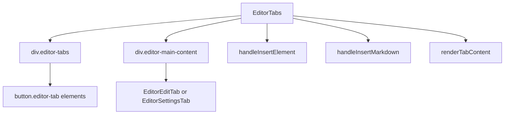

# Документация для src/components/editor/ui/tabs/EditorTabs.js

## 1. Назначение файла

Файл `src/components/editor/ui/tabs/EditorTabs.js` определяет компонент вкладок редактора. Он координирует отображение различных вкладок редактора и передает соответствующие пропсы в каждую вкладку.

## 2. Экспортируемые компоненты и классы

### EditorTabs
Компонент вкладок редактора:
- **Тип**: React компонент
- **Назначение**: Координирует отображение вкладок редактора и передает пропсы
- **Пропсы**:
  - `activeTab` (string) - идентификатор активной вкладки
  - `onTabChange` (function) - обработчик изменения активной вкладки
  - `darkMode` (boolean) - режим темной темы
  - `showTextarea` (boolean) - отображение текстового поля
  - `onToggleTextarea` (function) - обработчик переключения текстового поля
  - `tabs` (Array) - массив вкладок для отображения
  - `content` (string) - содержимое редактора
  - `onChange` (function) - обработчик изменения содержимого
  - `onImageUpload` (function) - обработчик загрузки изображений
  - `nodeData` (object) - данные узла
  - `onNodeDataChange` (function) - обработчик изменения данных узла
  - `showPreview` (boolean) - отображение предварительного просмотра
  - `onTogglePreview` (function) - обработчик переключения предварительного просмотра
  - `previewMode` (string) - режим предварительного просмотра
  - `onPreviewModeChange` (function) - обработчик изменения режима предварительного просмотра
  - `nodeWidth` (number) - ширина узла
  - `onWidthChange` (function) - обработчик изменения ширины узла
  - `textareaRef` (React.RefObject) - ссылка на textarea

## 3. Структуру экспорта

```javascript
// Экспорт компонента EditorTabs
export const EditorTabs = ({ activeTab, onTabChange, darkMode, showTextarea, onToggleTextarea, tabs, content, onChange, onImageUpload, nodeData, onNodeDataChange, showPreview, onTogglePreview, previewMode, onPreviewModeChange, nodeWidth, onWidthChange, textareaRef }) => {...};
```

## 4. Взаимодействие с другими компонентами

### Внутренние зависимости
- `React` - основной фреймворк для построения интерфейса
- `../../constants` - константы редактора
- `./EditorEditTab` - вкладка редактирования
- `./EditorSettingsTab` - вкладка настроек
- `../toolbar` - утилиты панели инструментов

### Используемые компоненты внутри EditorTabs
1. `div` - HTML элементы для создания структуры вкладок
2. `button` - HTML элементы для кнопок вкладок
3. `EditorEditTab` - компонент вкладки редактирования
4. `EditorSettingsTab` - компонент вкладки настроек

### Вспомогательные функции
- `handleInsertElement` - обработчик вставки элементов
- `handleInsertMarkdown` - обработчик вставки markdown
- `renderTabContent` - функция рендеринга содержимого активной вкладки
- `insertElement` - утилита вставки элементов
- `insertMarkdown` - утилита вставки markdown

## 5. Используемые зависимости

### Внешние зависимости
- `React` - основной фреймворк для построения интерфейса

### Внутренние зависимости
- `../../constants` - константы редактора
- `./EditorEditTab` - вкладка редактирования
- `./EditorSettingsTab` - вкладка настроек
- `../toolbar` - утилиты панели инструментов

## 6. Архитектура компонента

Компонент `EditorTabs` представляет собой координатор вкладок редактора. Он управляет отображением вкладок и передает соответствующие пропсы в каждую вкладку.



Компонент реализует следующую функциональность:
1. Отображение заголовков вкладок
2. Переключение между вкладками
3. Рендеринг содержимого активной вкладки
4. Передача всех необходимых пропсов в дочерние компоненты
5. Обработка вставки элементов и markdown
6. Использование CSS классов для стилизации
7. Поддержка кастомных вкладок через пропс tabs