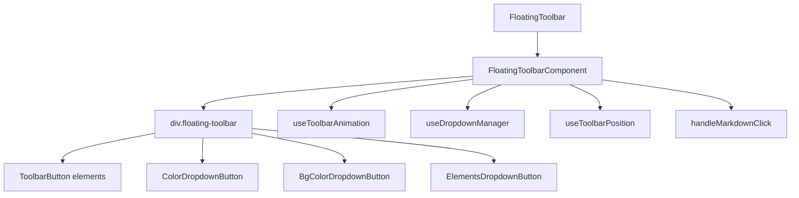

# Документация для src/components/editor/ui/toolbar/FloatingToolbar.js

## 1. Назначение файла

Файл `src/components/editor/ui/toolbar/FloatingToolbar.js` определяет компонент плавающего тулбара, который появляется над выделенным текстом при редактировании. Он следует принципу единственной ответственности, отвечая только за координацию UI компонентов.

## 2. Экспортируемые компоненты и классы

### FloatingToolbar
Компонент плавающего тулбара:
- **Тип**: React компонент (memo)
- **Назначение**: Отображает плавающий тулбар над выделенным текстом
- **Пропсы**:
  - `isVisible` (boolean) - видимость тулбара
  - `position` (Object) - позиция тулбара {x, y}
  - `onInsertMarkdown` (Function) - обработчик вставки markdown
  - `onInsertElement` (Function) - обработчик вставки элемента
  - `getSelectedText` (Function) - функция получения выделенного текста
  - `darkMode` (boolean) - темный режим (по умолчанию false)

## 3. Структуру экспорта

```javascript
// Экспорт компонента FloatingToolbar
export const FloatingToolbar = React.memo(FloatingToolbarComponent, (prevProps, nextProps) => {...});
```

## 4. Взаимодействие с другими компонентами

### Внутренние зависимости
- `React` - основной фреймворк для построения интерфейса
- `../EditorIcons` - иконки редактора
- `./buttons/ToolbarButton` - кнопки тулбара
- `./buttons/toolbarButtonsConfig` - конфигурация кнопок
- `./ToolbarDropdowns` - выпадающие списки тулбара
- `../../../../core/hooks/editor/toolbar/useToolbarAnimation` - хук анимации тулбара
- `../../../../core/hooks/editor/toolbar/useDropdownManager` - хук управления выпадающими списками
- `../../../../core/hooks/editor/toolbar/useToolbarPosition` - хук позиционирования тулбара
- `../../constants` - константы редактора
- `../wysiwyg/utils/Logger` - логгер
- `../style/FloatingToolbar.css` - стили тулбара

### Используемые компоненты внутри FloatingToolbar
1. `div` - HTML элементы для создания структуры тулбара
2. `ToolbarButton` - кнопки тулбара
3. `ColorDropdownButton` - выпадающий список цветов текста
4. `BgColorDropdownButton` - выпадающий список цветов фона
5. `ElementsDropdownButton` - выпадающий список элементов
6. `useToolbarAnimation` - хук анимации тулбара
7. `useDropdownManager` - хук управления выпадающими списками
8. `useToolbarPosition` - хук позиционирования тулбара

### Вспомогательные функции
- `handleMarkdownClick` - обработчик клика по markdown кнопке
- `FloatingToolbarComponent` - основной компонент тулбара

## 5. Используемые зависимости

### Внешние зависимости
- `React` - основной фреймворк для построения интерфейса

### Внутренние зависимости
- `../EditorIcons` - иконки редактора
- `./buttons/ToolbarButton` - кнопки тулбара
- `./buttons/toolbarButtonsConfig` - конфигурация кнопок
- `./ToolbarDropdowns` - выпадающие списки тулбара
- `../../../../core/hooks/editor/toolbar/useToolbarAnimation` - хук анимации тулбара
- `../../../../core/hooks/editor/toolbar/useDropdownManager` - хук управления выпадающими списками
- `../../../../core/hooks/editor/toolbar/useToolbarPosition` - хук позиционирования тулбара
- `../../constants` - константы редактора
- `../wysiwyg/utils/Logger` - логгер
- `../style/FloatingToolbar.css` - стили тулбара

## 6. Архитектура компонента

Компонент `FloatingToolbar` представляет собой координатор UI компонентов плавающего тулбара. Он использует хуки для управления состоянием и мемоизацию для оптимизации производительности.



Компонент реализует следующую функциональность:
1. Отображение плавающего тулбара над выделенным текстом
2. Анимация появления и исчезновения тулбара
3. Позиционирование тулбара относительно выделенного текста
4. Управление выпадающими списками
5. Обработка кликов по markdown кнопкам
6. Вставка элементов и markdown
7. Адаптация под темную/светлую тему
8. Оптимизация производительности через мемоизацию