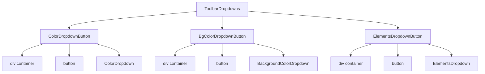

# Документация для src/components/editor/ui/toolbar/ToolbarDropdowns.js

## 1. Назначение файла

Файл `src/components/editor/ui/toolbar/ToolbarDropdowns.js` определяет компоненты выпадающих списков для плавающего тулбара. Он содержит три основных компонента для работы с цветами текста, цветами фона и элементами.

## 2. Экспортируемые компоненты и классы

### ColorDropdownButton
Компонент кнопки выпадающего списка цветов текста:
- **Тип**: React компонент
- **Назначение**: Отображает кнопку для открытия выпадающего списка цветов текста
- **Пропсы**:
  - `dropdownManager` (Object) - менеджер состояния выпадающих списков
  - `onInsertElement` (Function) - обработчик вставки элемента
  - `darkMode` (boolean) - темный режим

### BgColorDropdownButton
Компонент кнопки выпадающего списка цветов фона:
- **Тип**: React компонент
- **Назначение**: Отображает кнопку для открытия выпадающего списка цветов фона
- **Пропсы**:
  - `dropdownManager` (Object) - менеджер состояния выпадающих списков
  - `onInsertElement` (Function) - обработчик вставки элемента
  - `darkMode` (boolean) - темный режим

### ElementsDropdownButton
Компонент кнопки выпадающего списка элементов:
- **Тип**: React компонент
- **Назначение**: Отображает кнопку для открытия выпадающего списка элементов
- **Пропсы**:
  - `dropdownManager` (Object) - менеджер состояния выпадающих списков
  - `onInsertElement` (Function) - обработчик вставки элемента
  - `darkMode` (boolean) - темный режим

## 3. Структуру экспорта

```javascript
// Экспорт компонента ColorDropdownButton
export function ColorDropdownButton({ dropdownManager, onInsertElement, darkMode }) {...}

// Экспорт компонента BgColorDropdownButton
export function BgColorDropdownButton({ dropdownManager, onInsertElement, darkMode }) {...}

// Экспорт компонента ElementsDropdownButton
export function ElementsDropdownButton({ dropdownManager, onInsertElement, darkMode }) {...}
```

## 4. Взаимодействие с другими компонентами

### Внутренние зависимости
- `React` - основной фреймворк для построения интерфейса
- `../EditorIcons` - иконки редактора
- `./buttons/ColorDropdown` - выпадающий список цветов текста
- `./buttons/BackgroundColorDropdown` - выпадающий список цветов фона
- `./buttons/ElementsDropdown` - выпадающий список элементов
- `../../constants` - константы редактора
- `../wysiwyg/utils/Logger` - логгер

### Используемые компоненты внутри функций
1. `div` - HTML элементы для создания контейнеров
2. `button` - HTML элементы для кнопок
3. `ColorDropdown` - выпадающий список цветов текста
4. `BackgroundColorDropdown` - выпадающий список цветов фона
5. `ElementsDropdown` - выпадающий список элементов
6. `EditorIcons.ChevronDown` - иконка стрелки вниз

### Вспомогательные функции
- Нет вспомогательных функций

## 5. Используемые зависимости

### Внешние зависимости
- `React` - основной фреймворк для построения интерфейса

### Внутренние зависимости
- `../EditorIcons` - иконки редактора
- `./buttons/ColorDropdown` - выпадающий список цветов текста
- `./buttons/BackgroundColorDropdown` - выпадающий список цветов фона
- `./buttons/ElementsDropdown` - выпадающий список элементов
- `../../constants` - константы редактора
- `../wysiwyg/utils/Logger` - логгер

## 6. Архитектура компонента

Файл `ToolbarDropdowns.js` представляет собой набор компонентов для отображения кнопок выпадающих списков в плавающем тулбаре. Каждый компонент отвечает за отображение одной категории выпадающих списков.



Файл реализует следующую функциональность:
1. Отображение кнопок для трех категорий выпадающих списков
2. Управление состоянием открытия/закрытия выпадающих списков через dropdownManager
3. Передачу обработчиков вставки элементов в дочерние компоненты
4. Адаптацию под темную/светлую тему
5. Использование иконок и визуальных элементов для обозначения типов выпадающих списков
6. Логирование ошибок при отсутствии обработчиков