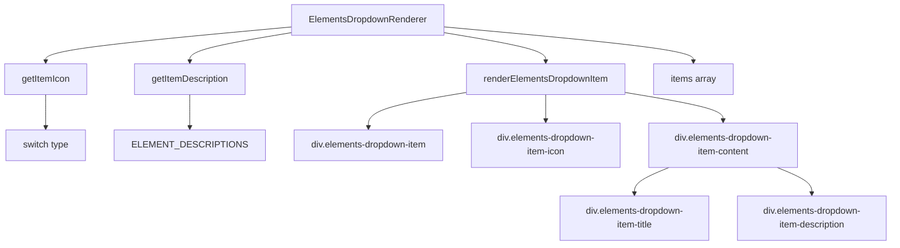

# Документация для src/components/editor/ui/toolbar/buttons/ElementsDropdownRenderer.js

## 1. Назначение файла

Файл `src/components/editor/ui/toolbar/buttons/ElementsDropdownRenderer.js` определяет функции для рендеринга элементов выпадающего списка ElementsDropdown. Он содержит утилиты для получения иконок и описаний элементов, а также функцию рендеринга элементов выпадающего списка.

## 2. Экспортируемые компоненты и классы

### getItemIcon
Функция получения иконки элемента:
- **Тип**: Функция
- **Назначение**: Возвращает иконку для элемента по его типу
- **Параметры**:
  - `type` (string) - тип элемента
- **Возвращает**: React элемент иконки

### getItemDescription
Функция получения описания элемента:
- **Тип**: Функция
- **Назначение**: Возвращает описание для элемента по его типу
- **Параметры**:
  - `type` (string) - тип элемента
- **Возвращает**: строку с описанием элемента

### renderElementsDropdownItem
Функция рендеринга элемента выпадающего списка:
- **Тип**: Функция
- **Назначение**: Рендерит элемент выпадающего списка ElementsDropdown
- **Параметры**:
  - `item` (object) - объект элемента
  - `isHovered` (boolean) - состояние наведения на элемент
  - `onMouseDown` (function) - обработчик нажатия мыши
  - `onMouseEnter` (function) - обработчик наведения мыши
  - `onMouseLeave` (function) - обработчик ухода мыши
- **Возвращает**: React элемент элемента выпадающего списка

### items
Массив элементов выпадающего списка:
- **Тип**: Массив
- **Назначение**: Содержит конфигурацию элементов выпадающего списка
- **Содержит**: элементы из CUSTOM_NODE_BUTTONS_CONFIG

## 3. Структуру экспорта

```javascript
// Экспорт функции getItemIcon
export function getItemIcon(type) {...}

// Экспорт функции getItemDescription
export function getItemDescription(type) {...}

// Экспорт функции renderElementsDropdownItem
export function renderElementsDropdownItem(item, isHovered, onMouseDown, onMouseEnter, onMouseLeave) {...}

// Экспорт массива items
export const items = [...CUSTOM_NODE_BUTTONS_CONFIG];
```

## 4. Взаимодействие с другими компонентами

### Внутренние зависимости
- `React` - основной фреймворк для построения интерфейса
- `../../EditorIcons` - иконки редактора
- `../../../constants` - константы редактора

### Используемые компоненты внутри функций
1. `div` - HTML элементы для создания структуры элементов выпадающего списка
2. `span` - HTML элементы для текстовых иконок
3. `EditorIcons` - иконки редактора
4. `CUSTOM_NODE_BUTTONS_CONFIG` - конфигурация кнопок элементов
5. `ELEMENT_DESCRIPTIONS` - описания элементов

### Вспомогательные функции
- `getItemIcon` - функция получения иконки элемента
- `getItemDescription` - функция получения описания элемента

## 5. Используемые зависимости

### Внешние зависимости
- `React` - основной фреймворк для построения интерфейса

### Внутренние зависимости
- `../../EditorIcons` - иконки редактора
- `../../../constants` - константы редактора

## 6. Архитектура компонента

Файл `ElementsDropdownRenderer.js` представляет собой набор утилит для рендеринга элементов выпадающего списка ElementsDropdown. Он не содержит React компонентов, а только чистые функции для рендеринга.



Файл реализует следующую функциональность:
1. Получение иконок для элементов по типу
2. Получение описаний для элементов по типу
3. Рендеринг элементов выпадающего списка с иконками и описаниями
4. Управление состоянием наведения на элементы
5. Обработка событий мыши (нажатие, наведение, уход)
6. Использование CSS классов для стилизации
7. Экспорт конфигурации элементов из констант