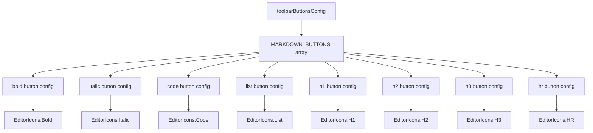

# Документация для src/components/editor/ui/toolbar/buttons/toolbarButtonsConfig.js

## 1. Назначение файла

Файл `src/components/editor/ui/toolbar/buttons/toolbarButtonsConfig.js` определяет конфигурацию кнопок тулбара. Он следует принципу открытости/закрытости, отвечая только за конфигурацию кнопок.

## 2. Экспортируемые компоненты и классы

### MARKDOWN_BUTTONS
Массив конфигураций кнопок markdown:
- **Тип**: Массив объектов
- **Назначение**: Содержит конфигурации кнопок markdown для тулбара

#### Структура элементов MARKDOWN_BUTTONS:
- `id` (string) - идентификатор кнопки
- `type` (string) - тип markdown элемента
- `icon` (React.ReactNode) - иконка кнопки
- `title` (string) - подсказка кнопки
- `requiresSelectedText` (boolean) - требует ли кнопка выделенного текста (опционально, по умолчанию true)

## 3. Структуру экспорта

```javascript
// Экспорт массива MARKDOWN_BUTTONS
export const MARKDOWN_BUTTONS = [...];
```

## 4. Взаимодействие с другими компонентами

### Внутренние зависимости
- `../../EditorIcons` - иконки редактора

### Используемые компоненты внутри конфигурации
1. `EditorIcons` - иконки редактора для каждой кнопки

### Вспомогательные функции
- Нет вспомогательных функций

## 5. Используемые зависимости

### Внешние зависимости
- Нет внешних зависимостей

### Внутренние зависимости
- `../../EditorIcons` - иконки редактора

## 6. Архитектура компонента

Файл `toolbarButtonsConfig.js` представляет собой конфигурационный файл, содержащий массив конфигураций кнопок markdown. Он следует принципу открытости/закрытости, предоставляя конфигурацию без изменения логики.



Файл реализует следующую функциональность:
1. Определение конфигураций кнопок markdown
2. Назначение иконок для каждой кнопки
3. Назначение подсказок для каждой кнопки
4. Указание необходимости выделенного текста для некоторых кнопок
5. Предоставление массива конфигураций для использования в тулбаре