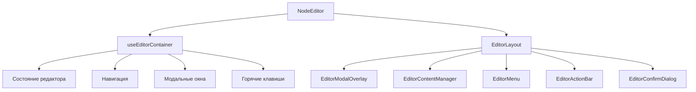

# Документация для src/components/editor/index.js

## 1. Назначение файла

Файл `src/components/editor/index.js` является точкой входа для компонента редактора узлов в приложении. Он экспортирует основной компонент `NodeEditor`, который представляет собой модальное окно для редактирования содержимого узлов в графическом интерфейсе приложения.

## 2. Экспортируемые компоненты и классы

### NodeEditor
Основной компонент редактора узлов:
- **Тип**: React компонент
- **Назначение**: Отображает модальное окно редактора с полным интерфейсом для редактирования узлов
- **Пропсы**:
  - `isOpen` (boolean) - состояние открытия модального окна
  - `node` (object) - редактируемый узел
  - `onClose` (function) - обработчик закрытия редактора
  - `onSave` (function) - обработчик сохранения изменений
  - `darkMode` (boolean, по умолчанию false) - режим темной темы
  - `availableTags` (array) - доступные теги для применения
  - `availableNodes` (array) - доступные узлы для ссылок
  - `onImageUpload` (function) - обработчик загрузки изображений
  - `currentLevel` (string) - текущий уровень навигации
  - `onNavigateToNextLevel` (function) - обработчик перехода на следующий уровень

### EditorLayout
Вспомогательный компонент для структуры редактора:
- **Тип**: React компонент
- **Назначение**: Определяет компоновку элементов внутри модального окна редактора

## 3. Структуру экспорта

```javascript
// Экспорт компонента EditorLayout
export { EditorLayout } from './ui/EditorLayout';

// Экспорт основного компонента NodeEditor
export const NodeEditor = ({...}) => {...};

// Экспорт по умолчанию
export default NodeEditor;
```

## 4. Взаимодействие с другими компонентами

### Внутренние зависимости
- `./ui/EditorLayout` - компоновка интерфейса редактора
- `../../core/hooks/editor/useEditorContainer` - хук для управления состоянием редактора

### Используемые компоненты внутри EditorLayout
1. `EditorModalOverlay` - модальное окно редактора
2. `EditorContentManager` - менеджер содержимого редактора
3. `EditorMenu` - меню редактора
4. `EditorActionBar` - панель действий
5. `EditorConfirmDialog` - диалог подтверждения

### Хуки
- `useEditorContainer` - основной хук управления редактором, который координирует:
  - Состояние редактора (содержимое, данные узла, изменения)
  - Навигацию между уровнями
  - Управление модальными окнами
  - Обработку горячих клавиш
  - Сохранение данных

## 5. Используемые зависимости

### Внешние зависимости
- `React` - основной фреймворк для построения интерфейса

### Внутренние зависимости
- `./ui/EditorLayout` - компонент компоновки редактора
- `../../core/hooks/editor/useEditorContainer` - хук управления редактором
- Различные компоненты из `./ui/`:
  - `EditorModalOverlay`
  - `EditorContentManager`
  - `EditorMenu`
  - `EditorActionBar`
  - `EditorConfirmDialog`

## 6. Архитектура компонента



Компонент `NodeEditor` служит координатором между пользовательским интерфейсом и логикой редактирования, используя хук `useEditorContainer` для управления всеми аспектами работы редактора.