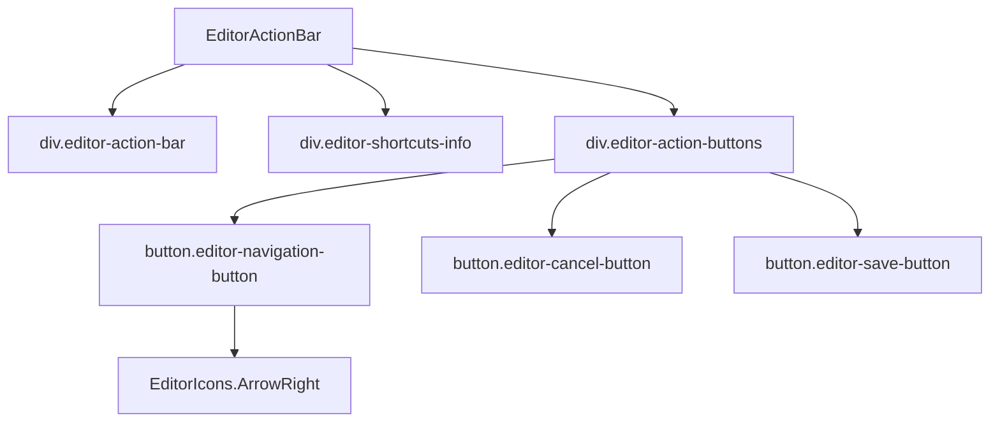

# Документация для src/components/editor/ui/EditorActionBar.js

## 1. Назначение файла

Файл `src/components/editor/ui/EditorActionBar.js` определяет компонент панели действий редактора. Он отвечает за отображение кнопок действий (Сохранить, Отмена) и навигации, следуя принципу единственной ответственности (SRP).

## 2. Экспортируемые компоненты и классы

### EditorActionBar
Компонент панели действий редактора:
- **Тип**: React компонент
- **Назначение**: Отображает кнопки действий и навигации в редакторе
- **Пропсы**:
  - `hasChanges` (boolean) - состояние наличия изменений
  - `onSave` (function) - обработчик сохранения
  - `onCancel` (function) - обработчик отмены
  - `darkMode` (boolean) - режим темной темы (по умолчанию false)
  - `canNavigateToNext` (boolean) - возможность перехода на следующий уровень
  - `nextLevel` (object) - следующий уровень навигации
  - `onNavigateToNextLevel` (function) - обработчик перехода на следующий уровень
  - `onClose` (function) - обработчик закрытия редактора

## 3. Структуру экспорта

```javascript
// Экспорт компонента EditorActionBar
export const EditorActionBar = ({ hasChanges, onSave, onCancel, darkMode = false, canNavigateToNext, nextLevel, onNavigateToNextLevel, onClose }) => {...};

// Экспорт по умолчанию
export default EditorActionBar;
```

## 4. Взаимодействие с другими компонентами

### Внутренние зависимости
- `React` - основной фреймворк для построения интерфейса
- `./EditorIcons` - иконки редактора
- `../constants` - константы редактора

### Используемые компоненты внутри EditorActionBar
1. `div` - HTML элементы для создания структуры панели
2. `button` - HTML элементы для создания кнопок действий
3. `EditorIcons.ArrowRight` - иконка стрелки вправо

### Вспомогательные функции
- `handleNavigateClick` - обработчик клика по кнопке навигации

## 5. Используемые зависимости

### Внешние зависимости
- `React` - основной фреймворк для построения интерфейса

### Внутренние зависимости
- `./EditorIcons` - иконки редактора
- `../constants` - константы редактора

## 6. Архитектура компонента

Компонент `EditorActionBar` следует принципу единственной ответственности (SRP), отвечая только за отображение панели действий редактора. Он использует CSS-in-JS для стилизации и адаптирует внешний вид под темную или светлую тему.



Компонент реализует следующую функциональность:
1. Отображение информации о горячих клавишах
2. Отображение кнопки перехода на следующий уровень (при наличии)
3. Отображение кнопок отмены и сохранения
4. Адаптация стилей под темную/светлую тему
5. Управление состоянием активности кнопок в зависимости от наличия изменений