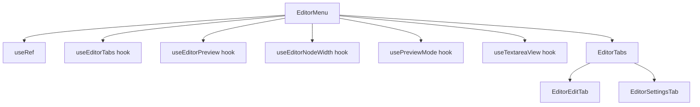

# Документация для src/components/editor/ui/EditorMenu.js

## 1. Назначение файла

Файл `src/components/editor/ui/EditorMenu.js` определяет основной редактор для markdown синтаксиса. Он координирует работу вкладок редактора и использует хуки для управления состоянием, следуя принципу единственной ответственности (SRP).

## 2. Экспортируемые компоненты и классы

### EditorMenu
Основной компонент редактора:
- **Тип**: React компонент
- **Назначение**: Координирует работу вкладок редактора и управляет состоянием
- **Пропсы**:
  - `content` (string) - содержимое редактора (по умолчанию '')
  - `onChange` (function) - обработчик изменения содержимого
  - `darkMode` (boolean) - режим темной темы (по умолчанию false)
  - `onImageUpload` (function) - обработчик загрузки изображений
  - `nodeData` (object) - данные узла (по умолчанию {})
  - `onNodeDataChange` (function) - обработчик изменения данных узла

## 3. Структуру экспорта

```javascript
// Экспорт компонента EditorMenu
export const EditorMenu = ({ content = '', onChange, darkMode = false, onImageUpload, nodeData = {}, onNodeDataChange }) => {...};

// Экспорт по умолчанию
export default EditorMenu;
```

## 4. Взаимодействие с другими компонентами

### Внутренние зависимости
- `React` - основной фреймворк для построения интерфейса
- `./tabs/EditorTabs` - вкладки редактора
- `../../../core/hooks/editor/useEditorTabs` - хук управления вкладками
- `../../../core/hooks/editor/useEditorPreview` - хук управления предпросмотром
- `../../../core/hooks/editor/useEditorNodeWidth` - хук управления шириной узла
- `../../../core/hooks/editor/usePreviewMode` - хук управления режимом предпросмотра
- `../../../core/hooks/editor/useTextareaView` - хук управления отображением textarea
- `./style/index.css` - стили компонента

### Используемые компоненты внутри EditorMenu
1. `div` - HTML элемент для создания контейнера
2. `useRef` - React хук для создания ссылки на textarea
3. `EditorTabs` - компонент вкладок редактора

### Используемые хуки
- `useEditorTabs` - управление вкладками редактора
- `useEditorPreview` - управление предпросмотром
- `useEditorNodeWidth` - управление шириной узла
- `usePreviewMode` - управление режимом предпросмотра
- `useTextareaView` - управление отображением textarea

## 5. Используемые зависимости

### Внешние зависимости
- `React` - основной фреймворк для построения интерфейса

### Внутренние зависимости
- `./tabs/EditorTabs` - вкладки редактора
- `../../../core/hooks/editor/useEditorTabs` - хук управления вкладками
- `../../../core/hooks/editor/useEditorPreview` - хук управления предпросмотром
- `../../../core/hooks/editor/useEditorNodeWidth` - хук управления шириной узла
- `../../../core/hooks/editor/usePreviewMode` - хук управления режимом предпросмотра
- `../../../core/hooks/editor/useTextareaView` - хук управления отображением textarea
- `./style/index.css` - стили компонента

## 6. Архитектура компонента

Компонент `EditorMenu` следует принципу единственной ответственности (SRP), координируя работу вкладок редактора и используя хуки для управления состоянием. Он передает все необходимые пропсы в компонент `EditorTabs`.



Компонент использует CSS-in-JS для стилизации и обеспечивает гибкую настройку внешнего вида редактора через передачу пропсов в дочерние компоненты.