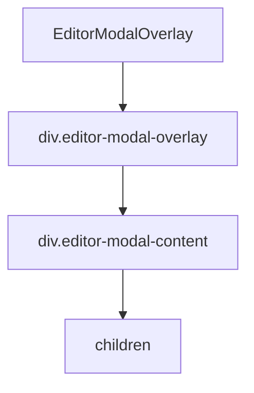

# Документация для src/components/editor/ui/EditorModalOverlay.js

## 1. Назначение файла

Файл `src/components/editor/ui/EditorModalOverlay.js` определяет компонент модального окна для редактора узлов. Он обеспечивает визуальное оформление модального окна с затемнением фона и центрированием содержимого.

## 2. Экспортируемые компоненты и классы

### EditorModalOverlay
Основной компонент модального окна редактора:
- **Тип**: React компонент
- **Назначение**: Создает модальное окно с затемнением фона для редактора узлов
- **Пропсы**:
  - `isOpen` (boolean) - состояние открытия модального окна
  - `onClose` (function) - обработчик закрытия модального окна
  - `darkMode` (boolean) - режим темной темы (по умолчанию false)
  - `children` (ReactNode) - содержимое модального окна

## 3. Структуру экспорта

```javascript
// Экспорт компонента EditorModalOverlay
export const EditorModalOverlay = ({ isOpen, onClose, darkMode = false, children }) => {...};
```

## 4. Взаимодействие с другими компонентами

### Внутренние зависимости
- `React` - основной фреймворк для построения интерфейса

### Используемые компоненты внутри EditorModalOverlay
1. `div` - HTML элементы для создания структуры модального окна

### Обработчики событий
- `handleOverlayClick` - обработчик клика на overlay для закрытия модального окна

## 5. Используемые зависимости

### Внешние зависимости
- `React` - основной фреймворк для построения интерфейса

## 6. Архитектура компонента

Компонент `EditorModalOverlay` представляет собой простой UI компонент, который создает модальное окно с затемнением фона. Он не содержит сложной логики и служит для визуального оформления модального окна редактора.



Компонент использует CSS-in-JS для стилизации, что позволяет легко адаптировать внешний вид под темную или светлую тему.