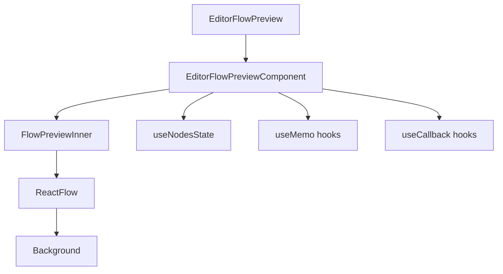

# Документация для src/components/editor/ui/preview/EditorFlowPreview.js

## 1. Назначение файла

Файл `src/components/editor/ui/preview/EditorFlowPreview.js` определяет компонент предварительного просмотра редактора с использованием React Flow. Он отображает содержимое узла в виде визуального представления для предварительного просмотра.

## 2. Экспортируемые компоненты и классы

### EditorFlowPreview
Компонент предварительного просмотра редактора:
- **Тип**: React компонент (memo)
- **Назначение**: Отображает предварительный просмотр содержимого узла в виде визуального представления
- **Пропсы**:
  - `content` (string) - содержимое узла для предварительного просмотра
  - `darkMode` (boolean) - режим темной темы
  - `nodeWidth` (number) - ширина узла (по умолчанию 300)

## 3. Структуру экспорта

```javascript
// Экспорт компонента EditorFlowPreview
export const EditorFlowPreview = React.memo(EditorFlowPreviewComponent, (prevProps, nextProps) => {...});
```

## 4. Взаимодействие с другими компонентами

### Внутренние зависимости
- `React` - основной фреймворк для построения интерфейса
- `ReactFlow` - библиотека для создания диаграмм
- `../../../diagram/node` - компоненты узлов
- `../../system/parser` - парсер содержимого
- `../../constants` - константы редактора

### Используемые компоненты внутри EditorFlowPreview
1. `div` - HTML элементы для создания контейнера
2. `ReactFlow` - основной компонент библиотеки React Flow
3. `Background` - компонент фона React Flow
4. `BaseNodeWrapper` - компонент обертки узла
5. `useNodesState` - хук управления состоянием узлов React Flow

### Вспомогательные функции
- `FlowPreviewInner` - внутренний компонент предварительного просмотра
- `extractTitle` - извлечение заголовка из содержимого
- `handleError` - обработчик ошибок React Flow
- `EditorFlowPreviewComponent` - основной компонент предварительного просмотра

## 5. Используемые зависимости

### Внешние зависимости
- `React` - основной фреймворк для построения интерфейса
- `ReactFlow` - библиотека для создания диаграмм

### Внутренние зависимости
- `../../../diagram/node` - компоненты узлов
- `../../system/parser` - парсер содержимого
- `../../constants` - константы редактора

## 6. Архитектура компонента

Компонент `EditorFlowPreview` представляет собой сложный UI компонент для отображения предварительного просмотра содержимого узла. Он использует React Flow для визуализации и мемоизацию для оптимизации производительности.



Компонент реализует следующую функциональность:
1. Отображение содержимого узла в виде визуального представления
2. Извлечение заголовка из содержимого
3. Создание предварительного узла для отображения
4. Управление состоянием узлов через React Flow
5. Адаптация под темную/светлую тему
6. Обработка ошибок React Flow
7. Оптимизация производительности через мемоизацию