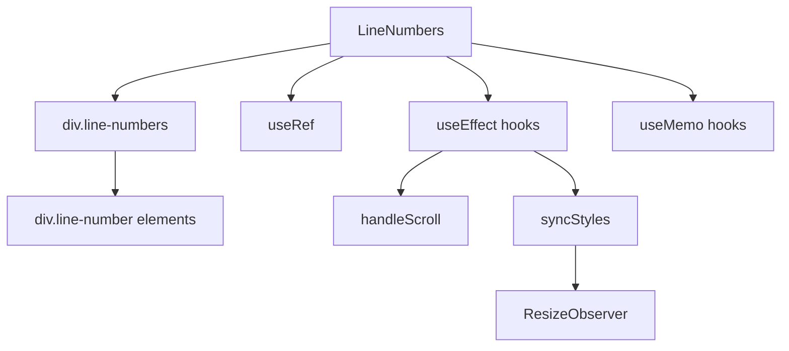

# Документация для src/components/editor/ui/syntax/LineNumbers.js

## 1. Назначение файла

Файл `src/components/editor/ui/syntax/LineNumbers.js` определяет компонент для отображения нумерации строк. Он отображается слева от textarea и синхронизируется со скроллом для обеспечения точного соответствия строк.

## 2. Экспортируемые компоненты и классы

### LineNumbers
Компонент нумерации строк:
- **Тип**: React компонент
- **Назначение**: Отображает нумерацию строк слева от textarea
- **Пропсы**:
  - `content` (string) - контент для подсчета строк
  - `textareaRef` (React.RefObject) - ссылка на textarea
  - `darkMode` (boolean) - темная тема (по умолчанию false)

## 3. Структуру экспорта

```javascript
// Экспорт компонента LineNumbers
export const LineNumbers = ({ content, textareaRef, darkMode = false }) => {...};

// Экспорт по умолчанию
export default LineNumbers;
```

## 4. Взаимодействие с другими компонентами

### Внутренние зависимости
- `React` - основной фреймворк для построения интерфейса
- `../style/LineNumbers.css` - стили нумерации строк

### Используемые компоненты внутри LineNumbers
1. `div` - HTML элементы для создания нумерации строк
2. `useRef` - React хук для создания ссылок
3. `useEffect` - React хук для управления побочными эффектами
4. `useMemo` - React хук для мемоизации вычислений

### Вспомогательные функции
- `handleScroll` - обработчик скролла для синхронизации с textarea
- `syncStyles` - функция синхронизации стилей с textarea

## 5. Используемые зависимости

### Внешние зависимости
- `React` - основной фреймворк для построения интерфейса

### Внутренние зависимости
- `../style/LineNumbers.css` - стили нумерации строк

## 6. Архитектура компонента

Компонент `LineNumbers` представляет собой UI компонент для отображения нумерации строк. Он использует мемоизацию для оптимизации вычислений и систему синхронизации с textarea для точного позиционирования.



Компонент реализует следующую функциональность:
1. Отображение нумерации строк слева от textarea
2. Вычисление количества строк на основе контента
3. Создание массива номеров строк
4. Синхронизация скролла с textarea
5. Точная синхронизация стилей с textarea
6. Отслеживание изменений размера textarea через ResizeObserver
7. Адаптация под темную/светлую тему