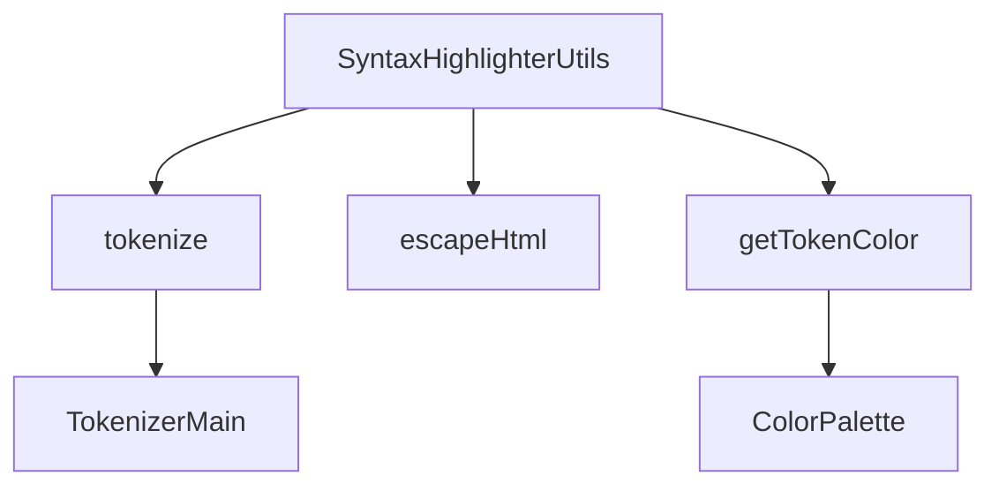

# Документация для src/components/editor/ui/syntax/SyntaxHighlighterUtils.js

## 1. Назначение файла

Файл `src/components/editor/ui/syntax/SyntaxHighlighterUtils.js` определяет утилиты для подсветки синтаксиса. Он содержит функции для токенизации текста, работы с позициями и экранирования HTML.

## 2. Экспортируемые компоненты и классы

### tokenize
Функция токенизации текста:
- **Тип**: Функция
- **Назначение**: Разбивает текст на токены для подсветки синтаксиса
- **Параметры**: Текст для токенизации
- **Возвращает**: Массив токенов

### escapeHtml
Функция экранирования HTML:
- **Тип**: Функция
- **Назначение**: Экранирует HTML символы в тексте
- **Параметры**: 
  - `text` (string) - текст для экранирования
- **Возвращает**: экранированный текст

### getTokenColor
Функция получения цвета для токена:
- **Тип**: Функция
- **Назначение**: Получает значение цвета по имени цвета
- **Параметры**: 
  - `colorName` (string) - имя цвета
- **Возвращает**: значение цвета или null

## 3. Структуру экспорта

```javascript
// Экспорт функции tokenize
export { tokenize };

// Экспорт функции escapeHtml
export function escapeHtml(text) {...}

// Экспорт функции getTokenColor
export function getTokenColor(colorName) {...}
```

## 4. Взаимодействие с другими компонентами

### Внутренние зависимости
- `../../system/parser/core/ParserConfig` - конфигурация парсера
- `./SyntaxTokenTypes` - типы токенов
- `../../constants/ColorPalette` - палитра цветов
- `./Token` - класс токена
- `./TokenizerMain` - основная логика токенизации

### Используемые функции
1. `tokenize` - основная функция токенизации из TokenizerMain
2. `escapeHtml` - функция экранирования HTML символов
3. `getTokenColor` - функция получения цвета для токена
4. `getColor` - функция получения значения цвета из палитры

## 5. Используемые зависимости

### Внешние зависимости
- Нет внешних зависимостей

### Внутренние зависимости
- `../../system/parser/core/ParserConfig` - конфигурация парсера
- `./SyntaxTokenTypes` - типы токенов
- `../../constants/ColorPalette` - палитра цветов
- `./Token` - класс токена
- `./TokenizerMain` - основная логика токенизации

## 6. Архитектура компонента

Файл `SyntaxHighlighterUtils.js` представляет собой набор утилит для подсветки синтаксиса. Он не содержит React компонентов, а только чистые функции для обработки текста.



Файл реализует следующую функциональность:
1. Токенизация текста через импорт из TokenizerMain
2. Экранирование HTML символов с сохранением переносов строк
3. Получение значений цветов для токенов цвета
4. Управление приоритетами токенов
5. Работа с позициями токенов в тексте