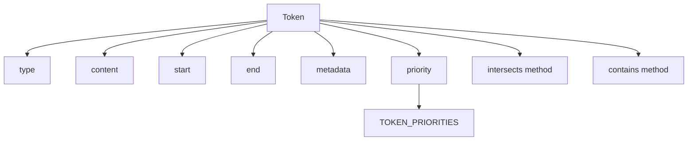

# Документация для src/components/editor/ui/syntax/Token.js

## 1. Назначение файла

Файл `src/components/editor/ui/syntax/Token.js` определяет класс Token для представления токенов в системе подсветки синтаксиса. Токен представляет собой элемент текста с определенным типом, позицией и метаданными.

## 2. Экспортируемые компоненты и классы

### Token
Класс токена:
- **Тип**: Класс
- **Назначение**: Представляет токен в системе подсветки синтаксиса

#### Конструктор Token:
- `type` (string) - тип токена
- `content` (string) - содержимое токена
- `start` (number) - начальная позиция токена в тексте
- `end` (number) - конечная позиция токена в тексте
- `metadata` (object) - дополнительные метаданные токена (по умолчанию {})

#### Свойства Token:
- `type` - тип токена
- `content` - содержимое токена
- `start` - начальная позиция токена в тексте
- `end` - конечная позиция токена в тексте
- `metadata` - дополнительные метаданные токена
- `priority` - приоритет токена (определяется по типу)

#### Методы Token:
- `intersects(other)` - проверяет пересечение с другим токеном
- `contains(position)` - проверяет, содержит ли токен указанную позицию

## 3. Структуру экспорта

```javascript
// Экспорт класса Token
export class Token {...}
```

## 4. Взаимодействие с другими компонентами

### Внутренние зависимости
- `./SyntaxTokenTypes` - типы токенов и приоритеты

### Используемые компоненты
1. `TOKEN_PRIORITIES` - объект с приоритетами токенов

## 5. Используемые зависимости

### Внешние зависимости
- Нет внешних зависимостей

### Внутренние зависимости
- `./SyntaxTokenTypes` - типы токенов и приоритеты

## 6. Архитектура компонента

Класс `Token` представляет собой простую модель данных для представления токенов в системе подсветки синтаксиса. Он инкапсулирует информацию о типе, позиции и содержимом токена, а также предоставляет методы для работы с позициями.



Класс реализует следующую функциональность:
1. Представление токена как структуры данных с типом, содержимым и позицией
2. Определение приоритета токена на основе его типа
3. Проверка пересечения с другими токенами
4. Проверка содержания указанной позиции
5. Хранение дополнительных метаданных