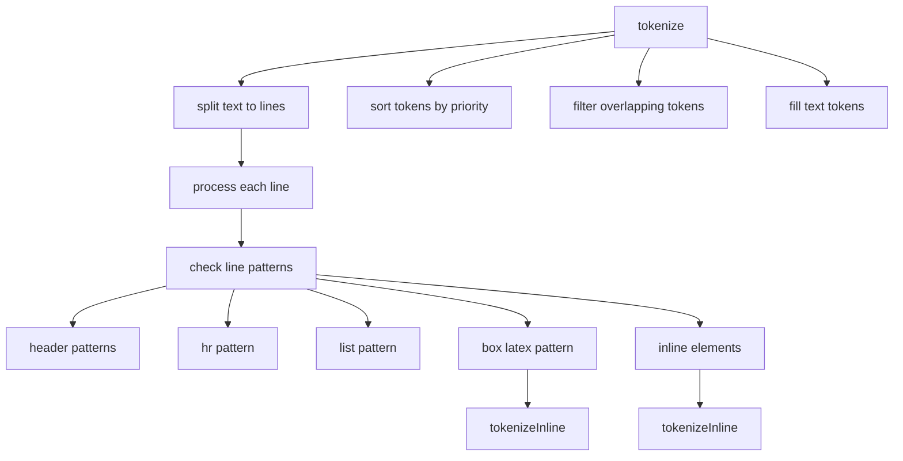

# Документация для src/components/editor/ui/syntax/TokenizerMain.js

## 1. Назначение файла

Файл `src/components/editor/ui/syntax/TokenizerMain.js` определяет основную функцию токенизации текста. Он обрабатывает весь текст целиком, разбивая его на строки и определяя типы элементов на уровне строк и отдельных элементов.

## 2. Экспортируемые компоненты и классы

### tokenize
Основная функция токенизации текста:
- **Тип**: Функция
- **Назначение**: Токенизирует весь текст, разбивая его на строки и определяя типы элементов
- **Параметры**:
  - `text` (string) - текст для токенизации
- **Возвращает**: Массив токенов

## 3. Структуру экспорта

```javascript
// Экспорт функции tokenize
export function tokenize(text) {...}
```

## 4. Взаимодействие с другими компонентами

### Внутренние зависимости
- `../../system/parser/core/ParserConfig` - конфигурация парсера
- `./SyntaxTokenTypes` - типы токенов
- `./Token` - класс токена
- `./Tokenizer` - функции токенизации отдельных строк

### Используемые компоненты внутри tokenize
1. `Token` - класс токена для создания токенов
2. `PARSER_CONFIG` - конфигурация парсера с паттернами
3. `TOKEN_TYPES` - типы токенов
4. `TOKEN_PRIORITIES` - приоритеты токенов
5. `tokenizeInline` - функция токенизации отдельных строк

### Вспомогательные функции
- `filterOverlappingTokens` - фильтрация пересекающихся токенов
- `fillTextTokens` - заполнение промежутков текстовыми токенами

## 5. Используемые зависимости

### Внешние зависимости
- Нет внешних зависимостей

### Внутренние зависимости
- `../../system/parser/core/ParserConfig` - конфигурация парсера
- `./SyntaxTokenTypes` - типы токенов
- `./Token` - класс токена
- `./Tokenizer` - функции токенизации отдельных строк

## 6. Архитектура компонента

Функция `tokenize` представляет собой основную точку входа в систему токенизации. Она обрабатывает весь текст целиком, разбивая его на строки и определяя типы элементов на разных уровнях.



Функция реализует следующую функциональность:
1. Разбиение текста на строки
2. Обработка каждой строки по отдельности
3. Определение типов элементов на уровне строк (заголовки, списки, разделители)
4. Обработка блочных LaTeX элементов с вложенными inline элементами
5. Обработка inline элементов через tokenizeInline
6. Сортировка токенов по приоритетам
7. Фильтрация пересекающихся токенов
8. Заполнение промежутков текстовыми токенами
9. Возврат полного массива токенов