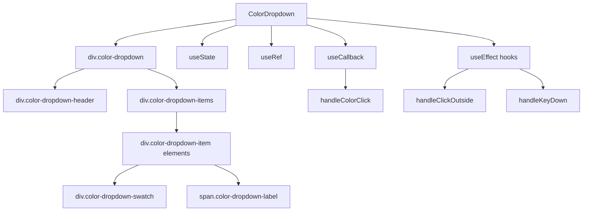

# Документация для src/components/editor/ui/toolbar/buttons/ColorDropdown.js

## 1. Назначение файла

Файл `src/components/editor/ui/toolbar/buttons/ColorDropdown.js` определяет компонент выпадающего списка для выбора цвета текста. Он отображает палитру поддерживаемых цветов и позволяет применить цвет к выделенному тексту.

## 2. Экспортируемые компоненты и классы

### ColorDropdown
Компонент выпадающего списка цветов текста:
- **Тип**: React компонент
- **Назначение**: Отображает выпадающий список для выбора цвета текста
- **Пропсы**:
  - `isOpen` (boolean) - состояние открытия выпадающего списка
  - `onClose` (function) - обработчик закрытия выпадающего списка
  - `onInsertElement` (function) - обработчик вставки элемента цвета текста
  - `darkMode` (boolean) - темный режим (по умолчанию false)

## 3. Структуру экспорта

```javascript
// Экспорт компонента ColorDropdown
export const ColorDropdown = ({ isOpen, onClose, onInsertElement, darkMode = false }) => {...};
```

## 4. Взаимодействие с другими компонентами

### Внутренние зависимости
- `React` - основной фреймворк для построения интерфейса
- `../../../constants/ColorPalette` - палитра поддерживаемых цветов
- `../../../constants` - константы редактора
- `../../wysiwyg/utils/Logger` - логгер
- `../../style/Dropdowns.css` - стили выпадающих списков

### Используемые компоненты внутри ColorDropdown
1. `div` - HTML элементы для создания структуры выпадающего списка
2. `useState` - React хук для управления состоянием наведения
3. `useRef` - React хук для создания ссылки на DOM элемент
4. `useCallback` - React хук для мемоизации обработчиков
5. `useEffect` - React хук для управления побочными эффектами

### Вспомогательные функции
- `handleColorClick` - обработчик клика по цвету
- `getColor` - функция получения значения цвета из палитры

## 5. Используемые зависимости

### Внешние зависимости
- `React` - основной фреймворк для построения интерфейса

### Внутренние зависимости
- `../../../constants/ColorPalette` - палитра поддерживаемых цветов
- `../../../constants` - константы редактора
- `../../wysiwyg/utils/Logger` - логгер
- `../../style/Dropdowns.css` - стили выпадающих списков

## 6. Архитектура компонента

Компонент `ColorDropdown` представляет собой UI компонент выпадающего списка цветов текста. Он использует React хуки для управления состоянием и обработчиками событий.



Компонент реализует следующую функциональность:
1. Отображение выпадающего списка цветов текста
2. Получение выделенного текста из textarea или contentEditable
3. Вставка элемента цвета текста с выделенным текстом
4. Обработка кликов вне выпадающего списка для закрытия
5. Обработка клавиш (Escape для закрытия, Enter для выбора цвета)
6. Управление состоянием наведения на цвета
7. Адаптация под темную/светлую тему
8. Использование CSS классов для стилизации
9. Логирование действий пользователя