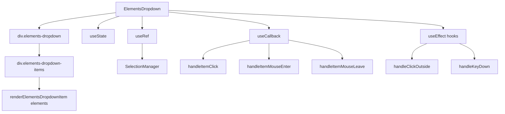

# Документация для src/components/editor/ui/toolbar/buttons/ElementsDropdown.js

## 1. Назначение файла

Файл `src/components/editor/ui/toolbar/buttons/ElementsDropdown.js` определяет компонент выпадающего списка в стиле Notion для выбора элементов синтаксиса. Он содержит все элементы синтаксиса, такие как LaTeX, изображения, хендлы и другие.

## 2. Экспортируемые компоненты и классы

### ElementsDropdown
Компонент выпадающего списка элементов:
- **Тип**: React компонент
- **Назначение**: Отображает выпадающий список в стиле Notion для выбора элементов синтаксиса
- **Пропсы**:
  - `isOpen` (boolean) - состояние открытия выпадающего списка
  - `onClose` (function) - обработчик закрытия выпадающего списка
  - `onInsertElement` (function) - обработчик вставки элемента
  - `darkMode` (boolean) - темный режим (по умолчанию false)

## 3. Структуру экспорта

```javascript
// Экспорт компонента ElementsDropdown
export const ElementsDropdown = ({ isOpen, onClose, onInsertElement, darkMode = false }) => {...};
```

## 4. Взаимодействие с другими компонентами

### Внутренние зависимости
- `React` - основной фреймворк для построения интерфейса
- `../../wysiwyg/utils/Logger` - логгер
- `./SelectionManager` - менеджер выделения текста
- `./ElementsDropdownRenderer` - рендерер элементов выпадающего списка
- `../../style/Dropdowns.css` - стили выпадающих списков

### Используемые компоненты внутри ElementsDropdown
1. `div` - HTML элементы для создания структуры выпадающего списка
2. `useState` - React хук для управления состоянием наведения
3. `useRef` - React хук для создания ссылок на DOM элементы
4. `useCallback` - React хук для мемоизации обработчиков
5. `useEffect` - React хук для управления побочными эффектами
6. `SelectionManager` - менеджер выделения текста
7. `renderElementsDropdownItem` - рендерер элементов выпадающего списка

### Вспомогательные функции
- `handleItemClick` - обработчик клика по элементу
- `handleItemMouseEnter` - обработчик наведения на элемент
- `handleItemMouseLeave` - обработчик ухода с элемента
- `getItemIcon` - функция получения иконки элемента
- `getItemDescription` - функция получения описания элемента

## 5. Используемые зависимости

### Внешние зависимости
- `React` - основной фреймворк для построения интерфейса

### Внутренние зависимости
- `../../wysiwyg/utils/Logger` - логгер
- `./SelectionManager` - менеджер выделения текста
- `./ElementsDropdownRenderer` - рендерер элементов выпадающего списка
- `../../style/Dropdowns.css` - стили выпадающих списков

## 6. Архитектура компонента

Компонент `ElementsDropdown` представляет собой UI компонент выпадающего списка элементов в стиле Notion. Он использует React хуки для управления состоянием и обработчиками событий, а также специализированные утилиты для работы с выделением текста.



Компонент реализует следующую функциональность:
1. Отображение выпадающего списка элементов в стиле Notion
2. Сохранение выделения текста при открытии выпадающего списка
3. Вставка элементов синтаксиса с выделенным текстом
4. Обработка кликов вне выпадающего списка для закрытия
5. Обработка клавиш (Escape для закрытия, Enter для выбора элемента)
6. Управление состоянием наведения на элементы
7. Адаптация под темную/светлую тему
8. Использование CSS классов для стилизации
9. Логирование действий пользователя