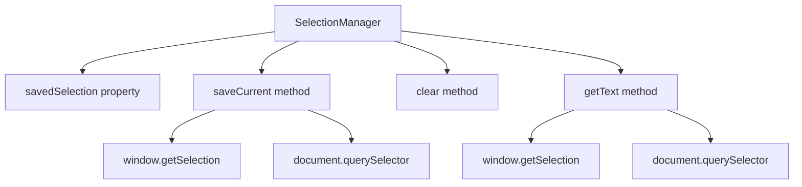

# Документация для src/components/editor/ui/toolbar/buttons/SelectionManager.js

## 1. Назначение файла

Файл `src/components/editor/ui/toolbar/buttons/SelectionManager.js` определяет класс SelectionManager для управления выделением текста в редакторе. Он позволяет сохранять, очищать и получать выделенный текст из различных источников (textarea и contentEditable).

## 2. Экспортируемые компоненты и классы

### SelectionManager
Класс менеджера выделения текста:
- **Тип**: Класс
- **Назначение**: Управляет выделением текста в редакторе

#### Конструктор SelectionManager:
- Не принимает параметров
- Инициализирует свойство savedSelection как null

#### Свойства SelectionManager:
- `savedSelection` - сохраненное выделение текста

#### Методы SelectionManager:
- `saveCurrent()` - сохраняет текущее выделение текста
- `clear()` - очищает сохраненное выделение
- `getText()` - возвращает выделенный текст

## 3. Структуру экспорта

```javascript
// Экспорт класса SelectionManager
export class SelectionManager {...}
```

## 4. Взаимодействие с другими компонентами

### Внутренние зависимости
- `../../wysiwyg/utils/Logger` - логгер

### Используемые компоненты внутри SelectionManager
1. `window.getSelection()` - API браузера для получения выделения
2. `document.querySelector()` - API браузера для поиска элементов
3. `log` - логгер для отладки

### Вспомогательные функции
- Нет вспомогательных функций

## 5. Используемые зависимости

### Внешние зависимости
- Нет внешних зависимостей

### Внутренние зависимости
- `../../wysiwyg/utils/Logger` - логгер

## 6. Архитектура компонента

Класс `SelectionManager` представляет собой утилиту для управления выделением текста в редакторе. Он инкапсулирует логику работы с выделением из разных источников и предоставляет унифицированный интерфейс для доступа к выделенному тексту.



Класс реализует следующую функциональность:
1. Сохранение выделения текста из contentEditable элементов
2. Сохранение выделения текста из textarea
3. Очистка сохраненного выделения
4. Получение выделенного текста из сохраненного выделения или текущего выделения
5. Логирование действий для отладки
6. Обработка случаев отсутствия выделения