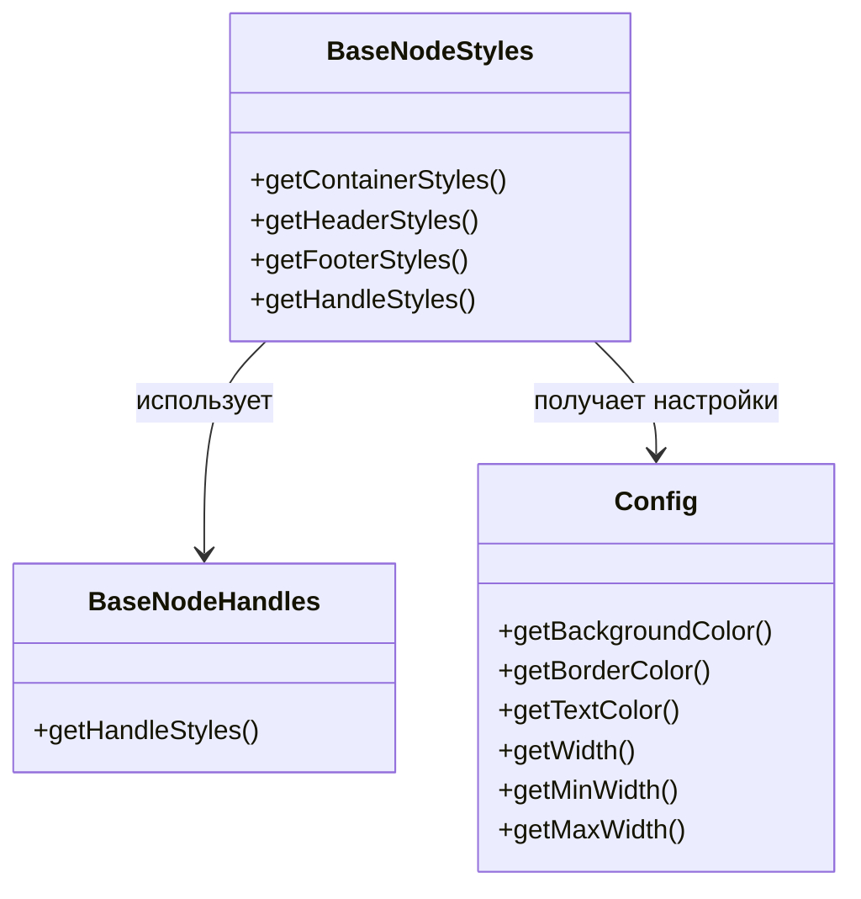

# BaseNodeStyles

## 1. Назначение компонента

Класс `BaseNodeStyles` отвечает исключительно за стилизацию узлов в диаграмме. Он предоставляет методы для генерации CSS-стилей для различных частей узла: контейнера, заголовка и футера. Этот класс является частью системы визуализации узлов и работает в связке с конфигурацией стилей и обработчиками узлов.

## 2. Основные функции и методы

### Конструктор
```javascript
constructor(config)
```
- Принимает объект конфигурации `config`
- Инициализирует экземпляр `BaseNodeHandles` для работы с хендлами узла

### Методы

#### getHandleStyles(data)
- Делегирует вызов методу `getHandleStyles` у экземпляра `BaseNodeHandles`
- Возвращает стили для хендлов узла

#### getContainerStyles(darkMode, selected, data, nodeProps = {})
- Генерирует стили для контейнера узла
- Учитывает темную тему, состояние выделения, данные узла и свойства узла
- Реализует логику приоритета размеров: `nodeProps` > `data` > `config` > минимальная ширина
- Ограничивает максимальную ширину согласно конфигурации
- Возвращает объект со стилями для контейнера узла

#### getHeaderStyles(darkMode)
- Генерирует стили для заголовка узла
- Адаптирует стили под темную/светлую тему
- Возвращает объект со стилями для заголовка

#### getFooterStyles(darkMode)
- Генерирует стили для футера узла
- Адаптирует стили под темную/светлую тему
- Возвращает объект со стилями для футера

## 3. Структура и логика работы со стилями узлов

### Приоритеты размеров
Реализована иерархия приоритетов для определения ширины узла:
1. `nodeProps.width` - ширина из свойств узла
2. `data.width` - ширина из данных узла
3. `config.getWidth()` - ширина по умолчанию из конфигурации
4. `config.getMinWidth()` - минимальная ширина из конфигурации

### Особенности стилизации контейнера
- Фиксированная ширина с возможностью ограничения через `maxWidth`
- Границы с цветом, зависящим от тега узла
- Тень при выделении узла
- Поддержка переноса текста внутри узла
- Позиционирование для корректного отображения хендлов

### Адаптация под темы
Все стили адаптируются под темную и светлую темы интерфейса, используя соответствующие цвета из конфигурации.

## 4. Взаимодействие с другими компонентами



## 5. Используемые зависимости

- `BaseNodeHandles` - локальный импорт из './BaseNodeHandles'
- Объект конфигурации, передаваемый в конструктор, который должен содержать методы:
  - `getBackgroundColor(darkMode)`
  - `getBorderColor(tag)`
  - `getTextColor(darkMode)`
  - `getWidth()`
  - `getMinWidth()`
  - `getMaxWidth()`