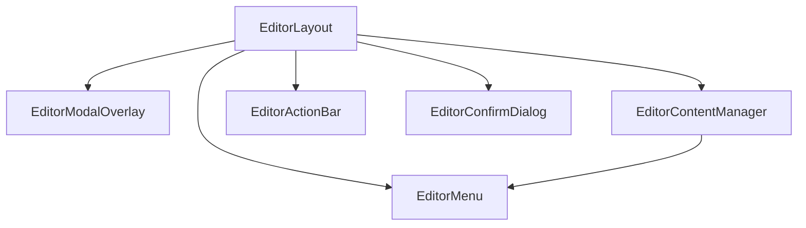

# Документация для src/components/editor/ui/EditorLayout.js

## 1. Назначение файла

Файл `src/components/editor/ui/EditorLayout.js` определяет структуру модального окна редактора узлов. Он координирует отображение всех компонентов редактора и управляет их взаимодействием.

## 2. Экспортируемые компоненты и классы

### EditorLayout
Основной компонент структуры редактора:
- **Тип**: React компонент
- **Назначение**: Определяет компоновку элементов внутри модального окна редактора
- **Пропсы**:
  - `isOpen` (boolean) - состояние открытия модального окна
  - `node` (object) - редактируемый узел
  - `editorData` (object) - данные редактора из useEditorContainer
  - `canNavigateToNext` (boolean) - возможность перехода на следующий уровень
  - `nextLevel` (string) - следующий уровень навигации
  - `handleSave` (function) - обработчик сохранения
  - `showConfirmDialog` (boolean) - отображение диалога подтверждения
  - `handleCancel` (function) - обработчик отмены
  - `handleConfirmClose` (function) - обработчик подтверждения закрытия
  - `handleCancelClose` (function) - обработчик отмены закрытия
  - `handleContentManagerData` (function) - обработчик данных менеджера контента
  - `handleHasChangesChange` (function) - обработчик изменения состояния изменений
  - `onClose` (function) - обработчик закрытия редактора
  - `darkMode` (boolean) - режим темной темы
  - `availableTags` (array) - доступные теги
  - `availableNodes` (array) - доступные узлы
  - `onImageUpload` (function) - обработчик загрузки изображений
  - `currentLevel` (string) - текущий уровень навигации
  - `onNavigateToNextLevel` (function) - обработчик перехода на следующий уровень

## 3. Структуру экспорта

```javascript
// Экспорт компонента EditorLayout
export const EditorLayout = ({...}) => {...};

// Экспорт по умолчанию
export default EditorLayout;
```

## 4. Взаимодействие с другими компонентами

### Внутренние зависимости
- `./EditorModalOverlay` - модальное окно редактора
- `./EditorContentManager` - менеджер содержимого редактора
- `./EditorMenu` - меню редактора
- `./EditorActionBar` - панель действий
- `./EditorConfirmDialog` - диалог подтверждения
- `../constants` - константы редактора

### Используемые компоненты внутри EditorLayout
1. `EditorModalOverlay` - модальное окно редактора
2. `EditorContentManager` - менеджер содержимого редактора
3. `EditorMenu` - меню редактора
4. `EditorActionBar` - панель действий
5. `EditorConfirmDialog` - диалог подтверждения

### Хуки
- `useCallback` - мемоизация обработчиков для предотвращения лишних перерендеров

## 5. Используемые зависимости

### Внешние зависимости
- `React` - основной фреймворк для построения интерфейса
- `useCallback` - хук для мемоизации функций

### Внутренние зависимости
- `./EditorModalOverlay` - модальное окно редактора
- `./EditorContentManager` - менеджер содержимого редактора
- `./EditorMenu` - меню редактора
- `./EditorActionBar` - панель действий
- `./EditorConfirmDialog` - диалог подтверждения
- `../constants` - константы редактора

## 6. Архитектура компонента



Компонент `EditorLayout` служит координатором между пользовательским интерфейсом и логикой редактирования, определяя структуру модального окна и управляя взаимодействием всех компонентов редактора.