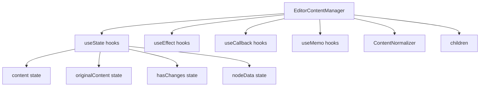

# Документация для src/components/editor/ui/EditorContentManager.js

## 1. Назначение файла

Файл `src/components/editor/ui/EditorContentManager.js` определяет компонент для управления контентом узла в редакторе. Он отвечает за инициализацию контента, отслеживание изменений и конвертацию данных между старым форматом узлов и новым markdown форматом.

## 2. Экспортируемые компоненты и классы

### EditorContentManager
Основной компонент управления контентом редактора:
- **Тип**: React компонент
- **Назначение**: Управляет контентом узла, отслеживает изменения и конвертирует данные
- **Пропсы**:
  - `node` (object) - редактируемый узел
  - `onContentChange` (function) - обработчик изменения контента
  - `onNodeDataChange` (function) - обработчик изменения данных узла
  - `onHasChangesChange` (function) - обработчик изменения состояния изменений
  - `onDataChange` (function) - обработчик изменения данных редактора
  - `children` (ReactNode) - дочерние компоненты

## 3. Структуру экспорта

```javascript
// Экспорт компонента EditorContentManager
export const EditorContentManager = ({ node, onContentChange, onNodeDataChange, onHasChangesChange, onDataChange, children }) => {...};

// Экспорт по умолчанию
export default EditorContentManager;
```

## 4. Взаимодействие с другими компонентами

### Внутренние зависимости
- `React` - основной фреймворк для построения интерфейса
- `./wysiwyg/core/ContentNormalizer` - нормализация контента

### Используемые компоненты внутри EditorContentManager
1. `div` - HTML элемент для создания контейнера
2. `useState`, `useEffect`, `useCallback`, `useMemo` - React хуки
3. `cloneElement`, `isValidElement` - React утилиты для работы с элементами

### Вспомогательные функции
- `convertLegacyNodeToContent` - конвертация старых данных узла в markdown контент
- `normalizeContent` - нормализация контента
- `handleContentChange` - обработчик изменения контента
- `handleNodeDataChange` - обработчик изменения данных узла

## 5. Используемые зависимости

### Внешние зависимости
- `React` - основной фреймворк для построения интерфейса

### Внутренние зависимости
- `./wysiwyg/core/ContentNormalizer` - нормализация контента

## 6. Архитектура компонента

Компонент `EditorContentManager` следует принципу единственной ответственности (SRP), отвечая только за управление контентом узла. Он инициализирует контент из узла, отслеживает изменения и конвертирует данные между форматами.



Компонент использует мемоизацию для оптимизации производительности и предотвращения лишних перерендеров. Он также нормализует контент при загрузке и при каждом изменении, разбивая строки с элементами на отдельные абзацы.