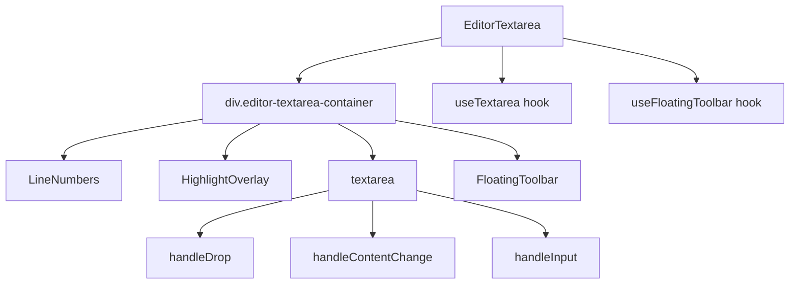

# Документация для src/components/editor/ui/EditorTextarea.js

## 1. Назначение файла

Файл `src/components/editor/ui/EditorTextarea.js` определяет текстовое поле редактора для компонента EditorMenu. Это упрощенная версия textarea с вынесенной логикой в хуки, обеспечивающая функциональность редактирования markdown контента с подсветкой синтаксиса и плавающей панелью инструментов.

## 2. Экспортируемые компоненты и классы

### EditorTextarea
Компонент текстового поля редактора:
- **Тип**: React компонент (forwardRef)
- **Назначение**: Предоставляет текстовое поле для редактирования markdown контента с подсветкой синтаксиса
- **Пропсы**:
  - `content` (string) - содержимое текстового поля
  - `onChange` (function) - обработчик изменения содержимого
  - `onImageUpload` (function) - обработчик загрузки изображений
  - `darkMode` (boolean) - режим темной темы
  - `onInsertMarkdown` (function) - обработчик вставки markdown
  - `onInsertElement` (function) - обработчик вставки элементов

## 3. Структуру экспорта

```javascript
// Экспорт компонента EditorTextarea
export const EditorTextarea = forwardRef(({ content, onChange, onImageUpload, darkMode, onInsertMarkdown, onInsertElement }, ref) => {...});
```

## 4. Взаимодействие с другими компонентами

### Внутренние зависимости
- `React` - основной фреймворк для построения интерфейса
- `./toolbar` - утилиты для работы с элементами
- `./toolbar/FloatingToolbar` - плавающая панель инструментов
- `../../../core/hooks/editor/useFloatingToolbar` - хук управления плавающей панелью
- `../../../core/hooks/editor/useTextarea` - хук управления textarea
- `./syntax` - компоненты подсветки синтаксиса
- `../constants` - константы редактора
- `./style/SyntaxHighlight.css` - стили подсветки синтаксиса
- `./style/LineNumbers.css` - стили нумерации строк

### Используемые компоненты внутри EditorTextarea
1. `div` - HTML элементы для создания контейнера
2. `textarea` - HTML элемент текстового поля
3. `LineNumbers` - компонент нумерации строк
4. `HighlightOverlay` - компонент подсветки синтаксиса
5. `FloatingToolbar` - плавающая панель инструментов

### Используемые хуки
- `useTextarea` - управление textarea
- `useFloatingToolbar` - управление плавающей панелью инструментов

### Вспомогательные функции
- `handleDrop` - обработчик перетаскивания файлов
- `insertElement` - вставка элементов
- `getSelectedText` - получение выделенного текста

## 5. Используемые зависимости

### Внешние зависимости
- `React` - основной фреймворк для построения интерфейса

### Внутренние зависимости
- `./toolbar` - утилиты для работы с элементами
- `./toolbar/FloatingToolbar` - плавающая панель инструментов
- `../../../core/hooks/editor/useFloatingToolbar` - хук управления плавающей панелью
- `../../../core/hooks/editor/useTextarea` - хук управления textarea
- `./syntax` - компоненты подсветки синтаксиса
- `../constants` - константы редактора
- `./style/SyntaxHighlight.css` - стили подсветки синтаксиса
- `./style/LineNumbers.css` - стили нумерации строк

## 6. Архитектура компонента

Компонент `EditorTextarea` представляет собой сложный UI компонент, объединяющий несколько функциональных элементов. Он использует хуки для управления состоянием и выносит сложную логику в отдельные модули.



Компонент реализует следующую функциональность:
1. Отображение текстового поля с подсветкой синтаксиса
2. Нумерация строк
3. Плавающая панель инструментов при выделении текста
4. Обработка перетаскивания изображений
5. Синхронизация внешнего контента с внутренним состоянием
6. Управление фокусом и стилями textarea
7. Адаптация под темную/светлую тему