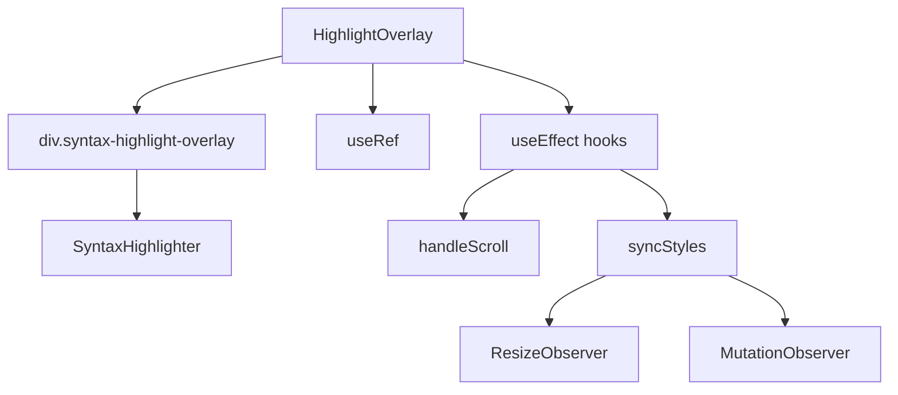

# Документация для src/components/editor/ui/syntax/HighlightOverlay.js

## 1. Назначение файла

Файл `src/components/editor/ui/syntax/HighlightOverlay.js` определяет компонент overlay для подсветки синтаксиса. Он отображается поверх textarea и показывает подсвеченный синтаксис markdown контента.

## 2. Экспортируемые компоненты и классы

### HighlightOverlay
Компонент overlay для подсветки синтаксиса:
- **Тип**: React компонент
- **Назначение**: Отображает подсветку синтаксиса поверх textarea
- **Пропсы**:
  - `content` (string) - контент для подсветки
  - `darkMode` (boolean) - темная тема
  - `textareaRef` (React.RefObject) - ссылка на textarea

## 3. Структуру экспорта

```javascript
// Экспорт компонента HighlightOverlay
export const HighlightOverlay = ({ content, darkMode, textareaRef }) => {...};

// Экспорт по умолчанию
export default HighlightOverlay;
```

## 4. Взаимодействие с другими компонентами

### Внутренние зависимости
- `React` - основной фреймворк для построения интерфейса
- `./SyntaxHighlighter` - компонент подсветки синтаксиса
- `../style/SyntaxHighlight.css` - стили подсветки синтаксиса

### Используемые компоненты внутри HighlightOverlay
1. `div` - HTML элементы для создания overlay
2. `SyntaxHighlighter` - компонент подсветки синтаксиса
3. `useRef` - React хук для создания ссылок
4. `useEffect` - React хук для управления побочными эффектами

### Вспомогательные функции
- `handleScroll` - обработчик скролла для синхронизации с textarea
- `syncStyles` - функция синхронизации стилей с textarea

## 5. Используемые зависимости

### Внешние зависимости
- `React` - основной фреймворк для построения интерфейса

### Внутренние зависимости
- `./SyntaxHighlighter` - компонент подсветки синтаксиса
- `../style/SyntaxHighlight.css` - стили подсветки синтаксиса

## 6. Архитектура компонента

Компонент `HighlightOverlay` представляет собой UI компонент для отображения подсветки синтаксиса поверх textarea. Он использует сложную систему синхронизации с textarea для точного позиционирования и стилизации.



Компонент реализует следующую функциональность:
1. Отображение подсветки синтаксиса поверх textarea
2. Синхронизация скролла с textarea
3. Точная синхронизация стилей с textarea
4. Отслеживание изменений размера textarea через ResizeObserver
5. Отслеживание изменений стилей textarea через MutationObserver
6. Адаптация под темную/светлую тему
7. Использование requestAnimationFrame для гарантии синхронизации стилей