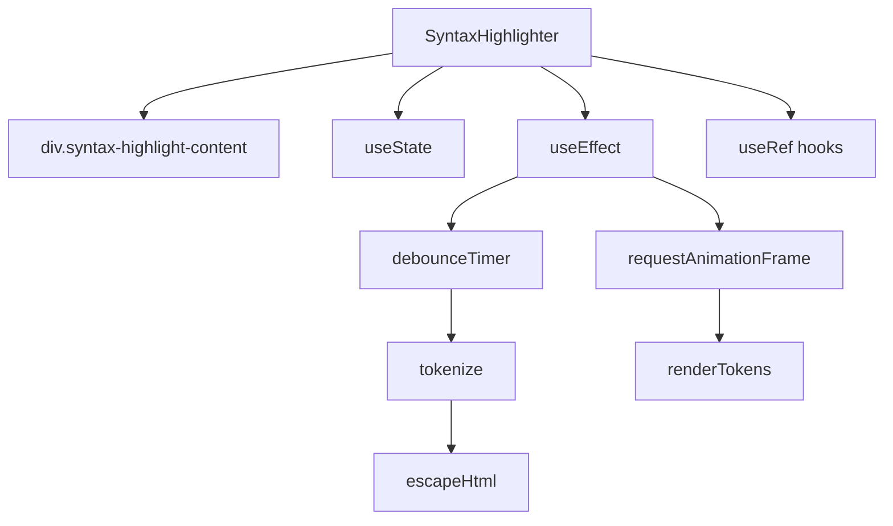

# Документация для src/components/editor/ui/syntax/SyntaxHighlighter.js

## 1. Назначение файла

Файл `src/components/editor/ui/syntax/SyntaxHighlighter.js` определяет компонент для подсветки синтаксиса markdown. Он преобразует текст в HTML с подсветкой синтаксиса и оптимизирован для быстрого ввода через дебаунсинг и requestAnimationFrame.

## 2. Экспортируемые компоненты и классы

### SyntaxHighlighter
Компонент для подсветки синтаксиса:
- **Тип**: React компонент
- **Назначение**: Преобразует текст в HTML с подсветкой синтаксиса markdown
- **Пропсы**:
  - `content` (string) - контент для подсветки
  - `darkMode` (boolean) - темная тема (по умолчанию false)

## 3. Структуру экспорта

```javascript
// Экспорт компонента SyntaxHighlighter
export const SyntaxHighlighter = ({ content, darkMode = false }) => {...};

// Экспорт по умолчанию
export default SyntaxHighlighter;
```

## 4. Взаимодействие с другими компонентами

### Внутренние зависимости
- `React` - основной фреймворк для построения интерфейса
- `./SyntaxHighlighterUtils` - утилиты для подсветки синтаксиса
- `./TokenRenderer` - рендерер токенов

### Используемые компоненты внутри SyntaxHighlighter
1. `div` - HTML элемент для отображения подсвеченного контента
2. `useState` - React хук для управления состоянием отображаемого контента
3. `useEffect` - React хук для управления побочными эффектами
4. `useRef` - React хук для создания ссылок

### Вспомогательные функции
- `tokenize` - токенизация контента
- `escapeHtml` - экранирование HTML
- `renderTokens` - рендеринг токенов

## 5. Используемые зависимости

### Внешние зависимости
- `React` - основной фреймворк для построения интерфейса

### Внутренние зависимости
- `./SyntaxHighlighterUtils` - утилиты для подсветки синтаксиса
- `./TokenRenderer` - рендерер токенов

## 6. Архитектура компонента

Компонент `SyntaxHighlighter` представляет собой оптимизированный UI компонент для подсветки синтаксиса markdown. Он использует дебаунсинг и requestAnimationFrame для обеспечения высокой производительности при быстром вводе.



Компонент реализует следующую функциональность:
1. Подсветка синтаксиса markdown контента
2. Оптимизация производительности через дебаунсинг (50ms)
3. Откладывание обработки на следующий кадр анимации через requestAnimationFrame
4. Проверка актуальности контента перед обновлением
5. Обработка ошибок токенизации
6. Адаптация под темную/светлую тему
7. Использование dangerouslySetInnerHTML для отображения HTML