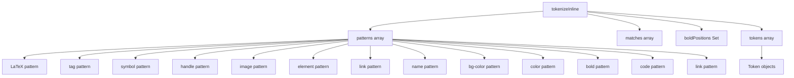

# Документация для src/components/editor/ui/syntax/Tokenizer.js

## 1. Назначение файла

Файл `src/components/editor/ui/syntax/Tokenizer.js` определяет функции для токенизации текста на уровне отдельных строк. Он обрабатывает встроенные элементы markdown и кастомные элементы приложения.

## 2. Экспортируемые компоненты и классы

### tokenizeInline
Функция токенизации отдельной строки:
- **Тип**: Функция
- **Назначение**: Токенизирует отдельную строку текста, находя встроенные элементы
- **Параметры**:
  - `line` (string) - строка текста для токенизации
  - `lineStart` (number) - начальная позиция строки в общем тексте
- **Возвращает**: Массив токенов

## 3. Структуру экспорта

```javascript
// Экспорт функции tokenizeInline
export function tokenizeInline(line, lineStart) {...}
```

## 4. Взаимодействие с другими компонентами

### Внутренние зависимости
- `../../system/parser/core/ParserConfig` - конфигурация парсера
- `./SyntaxTokenTypes` - типы токенов
- `./Token` - класс токена

### Используемые компоненты внутри tokenizeInline
1. `Token` - класс токена для создания токенов
2. `PARSER_CONFIG` - конфигурация парсера с паттернами
3. `TOKEN_TYPES` - типы токенов

### Вспомогательные функции
- Нет вспомогательных функций

## 5. Используемые зависимости

### Внешние зависимости
- Нет внешних зависимостей

### Внутренние зависимости
- `../../system/parser/core/ParserConfig` - конфигурация парсера
- `./SyntaxTokenTypes` - типы токенов
- `./Token` - класс токена

## 6. Архитектура компонента

Функция `tokenizeInline` представляет собой утилиту для токенизации отдельных строк текста. Она использует регулярные выражения для нахождения различных типов элементов и создает токены для них.



Функция реализует следующую функциональность:
1. Определение паттернов для различных типов элементов
2. Поиск совпадений по всем паттернам в строке
3. Обработка жирного текста и курсива с учетом пересечений
4. Создание токенов для всех найденных элементов
5. Возврат массива токенов