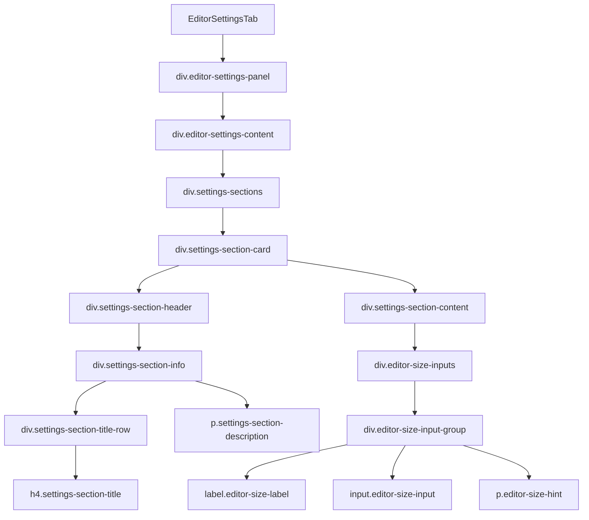

# Документация для src/components/editor/ui/tabs/EditorSettingsTab.js

## 1. Назначение файла

Файл `src/components/editor/ui/tabs/EditorSettingsTab.js` определяет вкладку настроек редактора. Она содержит интерфейс для настройки параметров узла, таких как ширина.

## 2. Экспортируемые компоненты и классы

### EditorSettingsTab
Компонент вкладки настроек:
- **Тип**: React компонент
- **Назначение**: Отображает вкладку настроек редактора
- **Пропсы**:
  - `nodeWidth` (number) - текущая ширина узла
  - `onWidthChange` (function) - обработчик изменения ширины узла

## 3. Структуру экспорта

```javascript
// Экспорт компонента EditorSettingsTab
export const EditorSettingsTab = ({ nodeWidth, onWidthChange }) => {...};
```

## 4. Взаимодействие с другими компонентами

### Внутренние зависимости
- `React` - основной фреймворк для построения интерфейса
- `../../constants` - константы редактора

### Используемые компоненты внутри EditorSettingsTab
1. `div` - HTML элементы для создания структуры вкладки
2. `h4` - HTML элемент для заголовка секции
3. `p` - HTML элемент для описания
4. `label` - HTML элемент для метки поля ввода
5. `input` - HTML элемент для поля ввода ширины узла

### Вспомогательные функции
- Нет вспомогательных функций

## 5. Используемые зависимости

### Внешние зависимости
- `React` - основной фреймворк для построения интерфейса

### Внутренние зависимости
- `../../constants` - константы редактора

## 6. Архитектура компонента

Компонент `EditorSettingsTab` представляет собой простой UI компонент для отображения настроек редактора. Он использует семантическую разметку для структурирования интерфейса настроек.



Компонент реализует следующую функциональность:
1. Отображение секции настроек размера узла
2. Отображение заголовка и описания секции
3. Отображение поля ввода для ширины узла
4. Передачу значения ширины узла и обработчика изменения
5. Использование констант для локализованных строк