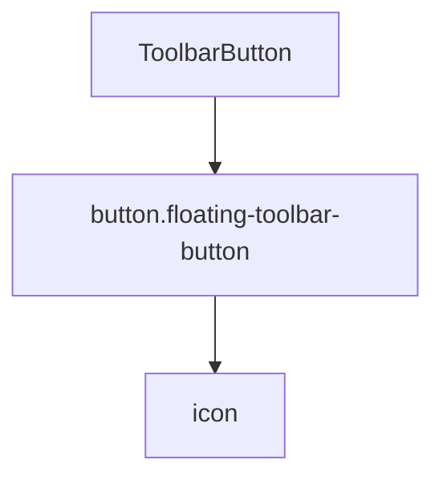

# Документация для src/components/editor/ui/toolbar/buttons/ToolbarButton.js

## 1. Назначение файла

Файл `src/components/editor/ui/toolbar/buttons/ToolbarButton.js` определяет компонент кнопки тулбара. Он следует принципу единственной ответственности, отвечая только за рендеринг одной кнопки тулбара.

## 2. Экспортируемые компоненты и классы

### ToolbarButton
Компонент кнопки тулбара:
- **Тип**: React компонент
- **Назначение**: Отображает кнопку тулбара с иконкой и обработчиком клика
- **Пропсы**:
  - `icon` (React.ReactNode) - иконка кнопки
  - `title` (string) - подсказка кнопки
  - `onClick` (Function) - обработчик клика

## 3. Структуру экспорта

```javascript
// Экспорт компонента ToolbarButton
export const ToolbarButton = ({ icon, title, onClick }) => {...};
```

## 4. Взаимодействие с другими компонентами

### Внутренние зависимости
- `React` - основной фреймворк для построения интерфейса

### Используемые компоненты внутри ToolbarButton
1. `button` - HTML элемент кнопки

### Вспомогательные функции
- Нет вспомогательных функций

## 5. Используемые зависимости

### Внешние зависимости
- `React` - основной фреймворк для построения интерфейса

### Внутренние зависимости
- Нет внутренних зависимостей

## 6. Архитектура компонента

Компонент `ToolbarButton` представляет собой простой UI компонент для отображения кнопки тулбара. Он следует принципу единственной ответственности, отвечая только за рендеринг одной кнопки.



Компонент реализует следующую функциональность:
1. Отображение кнопки тулбара с иконкой
2. Предотвращение потери выделения при клике (preventDefault на onMouseDown)
3. Обработка клика по кнопке
4. Отображение подсказки при наведении
5. Использование CSS класса для стилизации